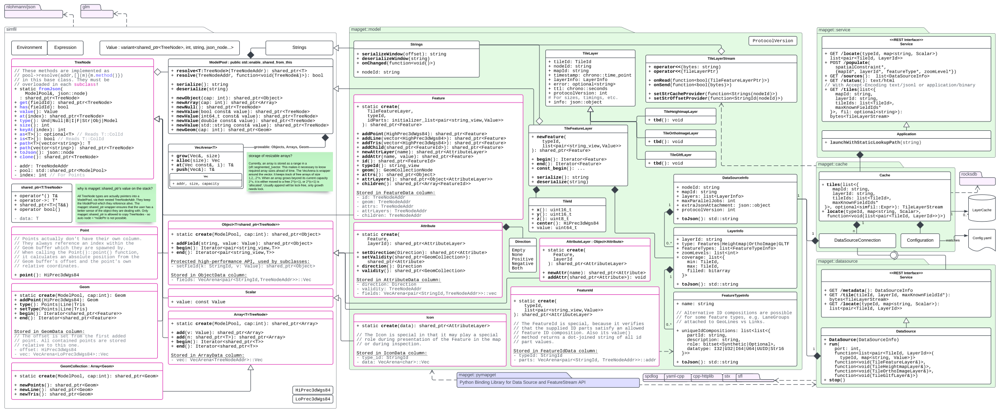

# mapget

*mapget* is a server-client solution for cached map feature data retrieval.

**Main Capabilities:**

* Coordinating requests for map data to various map data source processes.
* Integrated map data cache based on RocksDB.
* Simple data-source API with bindings for C++, Python and JS.
* Compact GeoJSON feature storage model - x times smaller than BSON.
* Integrated deep feature filter language based on (a subset of) *JSONata*
* Containerized server component.

## Map Data Sources

At the heart of *mapget* are data sources, which provide map feature data for
a specified tile area on the globe and a specified map layer. The data source
must provide information as to

1. Which maps it can serve (e.g. China/Michigan/Bavaria...).
2. Which layers it can serve (e.g. Lanes/POIs/...).
3. Which feature types are contained in a layer (e.g. Lane Boundaries/Lane Centerlines),
   and how they are uniquely identified.

As the *mapget* Cache is asked for a tile, e.g. using the `GET /tiles` REST API,
it first queries its cache for the relevant data. On a cache miss, it proceeds
to forward the request to one of its connected data sources for the specific requested
map.

## Map Features

The atomic units of geographic data which are served by *mapget* are *Features*.
The content of a *mapget* feature is aligned with that of a feature in *GeoJSON*:
A feature consists of a unique ID, some attributes, and some geometry. *mapget*
also allows features to have a list of child feature IDs. **Note:** Feature geometry
in *mapget* may always be 3D.

## Map Tiles

For performance reasons, *mapget* features are always served in a set covering
a whole tile. Each tile is identified by a zoom level `z` and two grid
coordinates `x` and `y`. *mapget* uses a binary tiling scheme for
the earths surface: The zoom level `z` controls the number of subdivisions for
the WGS84 longitudinal `[-180,180]` axis (columns) and latitudinal `[-90,90]` axis (rows).
The tile `x` coordinate indicates the column, and the `y` coordinate indicates the row.
On level zero, there are two columns and one row. In general, the number of rows is `2^z`,
and the number of columns is `2^(z+1)`.

The content of a tile is (leniently) coupled to the geographic extent of its tile id,
but also to the map layer it belongs to. When a data source creates a tile, it associates
the created tile with the name of the map - e.g. *"Europe-HD"*, and a map data layer,
e.g. *"Roads"* or *Lanes*.

## Implementing a Data Source

#### [`examples/cpp/local-datasource`](examples/cpp/local-datasource/main.cpp)

This example shows, how you can use the basic non-networked `mapget::Service`
in conjunction with a custom data source class which implements the `mapget::DataSource` interface.

#### [`examples/cpp/http-datasource`](examples/cpp/http-datasource/main.cpp)

This example shows how you can write a minimal networked data source service.

#### [`examples/python/datasource.py`](examples/python/datasource.py)

This example shows, how you can write a data source service in Python.
You can simply `pip install mapget` to get access to the mapget Python API.

## Retrieval Interface

The `mapget` library provides simple C++ and HTTP/REST interfaces, which may be
used to satisfy the following use-cases:

* Obtain streamed map feature tile data for given constraints.
* Locate a feature by its ID within any of the connected sources.
* Describe the available map data sources.
* View a simple HTML server status page (only for REST API).
* Instruct the cache to populate itself within given constraints from the connected sources.

The HTTP interface implemented in `mapget::HttpService` is a view on the C++ interface,
which is implemented in `mapget::Service`. Detailed endpoint descriptions:

```c++
// Describe the connected Data Sources
+ GET /sources():  list<DataSourceInfo>

// Get streamed features, according to hard constraints.
// With Accept-Encoding text/jsonl or application/binary
+ POST /tiles(list<{
    mapId: string,
    layerId: string,
    tileIds: list<TileId>,
        maxKnownFieldIds*
  }>, fil: optional<string>):
  bytes<TileLayerStream>

// Server status page
+ GET /status(): text/html

// Obtain a list of tile-layer combinations which provide a
// feature that satisfies the given ID field constraints.
// TODO: Not implemented
+ GET /locate(typeId, map<string, Scalar>)
  list<pair<TileId, LayerId>>

// Instruct the cache to *try* to fill itself with map data
// according to the provided constraints. No guarantees are
// made as to the timeliness or completeness of this task.
// TODO: Not implemented
+ POST /populate(
    spatialConstraint*,
    {mapId*, layerId*, featureType*, zoomLevel*}) 

// Write GeoJSON features for a tile back to a map data source
// which has supportedOperations&WRITE.
// TODO: Not implemented
+ POST /tile(
    mapId: string,
    layerId: string,
    tileId: TileId,
    features: list<object>): void
```

For example, the following curl call could be used to stream GeoJSON feature objects
from the `MyMap` data source defined previously:

```bash
curl -X POST \
    -H "Content-Type: application/json" \
    -H "Accept: application/jsonl" \
    -H "Connection: close" \
    -d '{
    "requests": [
        {
            "mapId": "MyFancyMap",
            "layerId": "MyFancyLayer",
            "tileIds": [1, 2, 3]
        }
    ]
}' "http://localhost:8080/tiles"
```

If we use `"Accept: application/binary"` instead, we get a binary stream of
tile data which we can parse in C++, Python or JS. Here is an example in C++, using
the `TileLayerStream` class:

```C++
// TODO: Outdated

#include "mapget/model/stream.h"
#include <iostream>

void main(int argc, char const *argv[])
{
    mapget::TileLayerStream::Reader streamParser;
    streamParser.onRead([](mapget::TileFeatureLayerPtr tileFeatureLayer){
        std::cout << "Got tile feature layer for " << tileFeatureLayer->tileId.value();
    });

    httplib::Client cli("localhost", 1234);
    auto res = cli.Get(
        "/tiles?mapId=MyMap&layerId=MyMapLayer&tileIds=393AC,36D97",
        {{"Accept", "application/binary"}},
        [&](const char *data, size_t length) {
            streamParser << std::string(data, length);
            return true;
        }
    );

    return 0;
}
```

We can also use `mapget::Service` instead of REST:

```C++
// TODO: Outdated

#include "mapget/tilestream.h"
#include "httplib.h"  // Using cpp-httplib
#include <iostream>

void main(int argc, char const *argv[])
{
    // Reads MAPGET_CACHE_DB and MAPGET_CONFIG_FILE environment vars.
    // You can override them in the constructor.

    mapget::Cache cache;

    cache.tiles({{"MyMap", "MyMapLayer", {0x393AC,0x36D97}}}).onRead(
        [](mapget::TileFeatureLayerPtr tileFeatureLayer){
            std::cout << "Got tile feature layer for " << tileFeatureLayer->tileId.value();
        }
    );

    return 0;
}
```

## Configuration

The `mapget::HttpService` class can parse a config file, from which it knows about available data source
endpoints. The path to this config file may be provided either via the `MAPGET_CONFIG_FILE` env.
var, or via a constructor parameter. The structure of
the file is as follows:

```yaml
sources:
   - <url>  # e.g. http://localhost:12345
```

## Architecture


