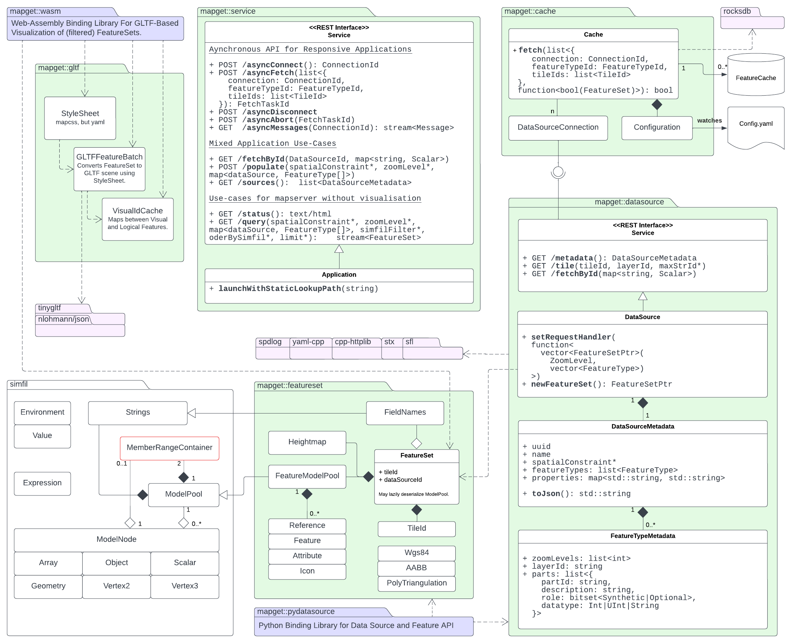

# mapget

*mapget* is a server-client solution for cached map feature data retrieval.

## Features

The atomic units of geographic data which are served by *mapget* are *Features*.
The content of a *mapget* feature is aligned with that of a feature in *GeoJSON*:
A feature consists of a unique ID, some attributes, and some geometry. *mapget*
also allows features to have a list of child feature IDs. Note: Feature geometry
in *mapget* may always be 3D.

## Tiles

For performance reasons, *mapget* features are always served in a set covering
a whole tile. Each tile is identified by a zoom level `z` and two grid
coordinates `x` and `y`. *mapget* uses a binary tiling scheme for
the earths surface: The zoom level `z` controls the number of subdivisions for
the WGS84 longitudinal `[-180,180]` axis (columns) and latitudinal `[-90,90]` axis (rows).
The tile `x` coordinate indicates the column, and the `y` coordinate indicates the row.
On level zero, there are two columns and one row. In general, the number of rows is `2^z`,
and the number of columns is `2^(z+1)`.

The content of a tile is tied to the geographic extent of its tile id, but also to
the map layer it belongs to. When a data source creates a tile, it associates the
created tile with the name of the map - e.g. *"Europe-HD"*, and a map data layer,
e.g. *"Roads"* or *Lanes*.

## Data Sources

### Introduction

At the heart of *mapget* are data sources, which provide map feature data for
a specified tile area on the globe and a specified map layer. The data source
must provide information as to

1. Which maps it can serve (e.g. China/Michigan/Bavaria...).
2. Which layers it can serve (e.g. Lanes/POIs/...).
3. Which feature types are contained in a layer (e.g. Lane Boundaries/Lane Centerlines),
   and how they are uniquely identified.

Implementing a data source could be as simple as the following example (C++):

```cpp
#include "mapget/datasource.h"

char const* myFeatureType = "FancyLineFeature";
char const* myFeatureId = "FancyLineFeatureId";

/**
 * Function which describes the data source.
 */
mapget::DataSourceInfo getDataSourceInfo()
{
    return mapget::SimpleDataSourceInfo("MyMap", "MyMapLayer", myFeatureType);
}

/**
 * Function which adds a feature to a FeatureSet.
 */
void addFeatures(std::shared_ptr<FeatureSet> featureSet)
{
    // Create a new feature.
    auto feature = featureSet->addFeature(myFeatureType);

    // Add a point to it to give it geometry.
    feature->geom()->addPoint(featureSet->tileId->center());

    // Set a simple key-value attribute.
    feature->attrs()->setField("name", "Darth Vader");

    // We can also create nested attributes.
    feature->attrs()->setField("greeting", featureSet->addObject()
        ->setField("en", "Hello World!"),
        ->setField("es", "Hola Mundo!"));
}

void main(int argc, char const *argv[])
{
    auto myDataSource = DataSource(getDataSourceInfo());

    myDataSource.run([&](auto tileId, auto layerId)
    {
        // Lambda function which supplies a feature-set for the
        // given tileId and layerId.

        assert(layerId == "MyMapLayer");
        auto featureSet = myDataSource.newFeatureSet();
        addFeatures(featureSet);

        return featureSet;
    });

    return 0;
}
```

**Note:** The referenced `SimpleDataSourceInfo` function is short for:

```cpp
return mapget::DataSourceInfo("MyMap", {
    mapget::LayerInfo(
        "MyMapLayer", // Name of our layer
        {
            mapget::FeatureTypeInfo(myFeatureType,
            {                             
                mapget::IdComponent(
                    myFeatureId,
                    mapget::IdType::U32
                )
            })
        }
    )
})
```

## Retrieval Interface

**TODO:** Describe C++/REST interface for feature cache.

## Configuration

**TODO:** Describe structure of `datasourceconfig.yam`.

## Architecture


