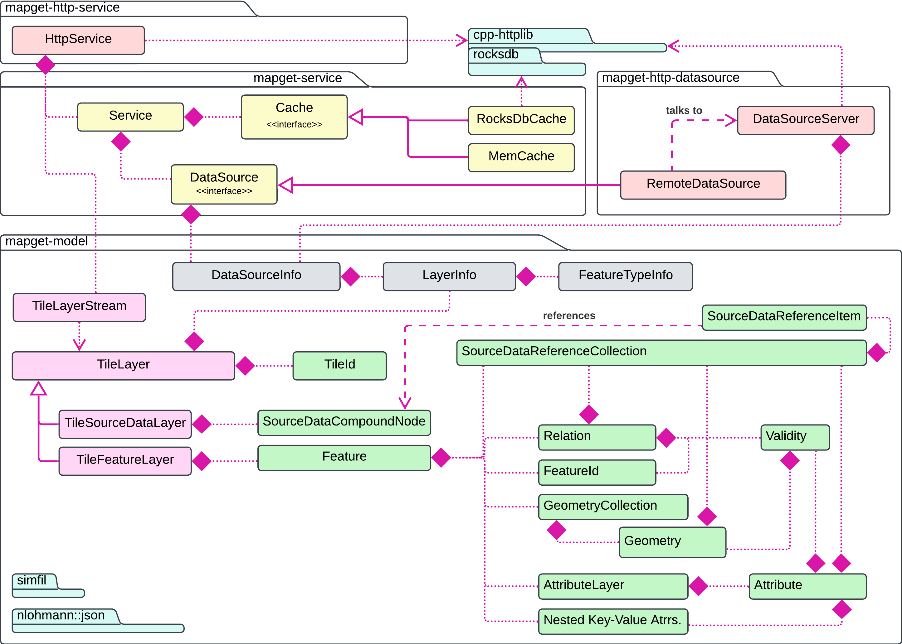

# mapget

*mapget* is a server-client solution for cached map feature data retrieval.

**Main Capabilities:**

* Coordinating requests for map data to various map data source processes.
* Integrated map data cache based on sqlite or RocksDB (*TODO: Evaluate best cache DB solution*), or a simple memory cache.
* Simple data-source API with bindings for C++, Python and JS.
* Compact GeoJSON feature storage model - [25 to 50% smaller than BSON/msgpack](docs/size-comparison/table.md).
* Integrated deep [feature filter language](https://github.com/klebert-engineering/simfil) based on (a subset of) *JSONata*
* PIP-installable server and client component.

## Python Package and CLI

The `mapget` package is deployed to PyPI for any Python version between 3.8 and 3.11. Simply running `pip install mapget` is enough to get you started:

* **`python -m mapget serve`** will run a server,
* **`python -m mapget fetch`** allows you to talk to a remote server,
* you can also use the Python package to write a data source, as documented [here](#implementing-a-data-source).

If you build `mapget` from source as described below, you obtain an executable that can be used analogously to the Python package with `mapget serve` or `mapget fetch`. 

## Configuration

The command line parameters for `mapget` and its subcommands can be viewed with:

```bash
mapget --help
mapget fetch --help
mapget serve --help
```

(or `python -m mapget --help` for the Python package).

The `mapget` executable can parse a config file with arguments supported by the command line interface. The path to the config file can be provided to `mapget` via command line by specifying the `--config` parameter.

Sample configuration files can be found under `examples/config`:

- [sample-first-datasource.toml](examples/config/sample-first-datasource.toml) and [sample-second-datasource.toml](examples/config/sample-second-datasource.toml) will configure mapget to run a simple datasource with sample data. Note: the two formats in config files for subcommand parameters can be used interchangeably.
- [sample-service.toml](examples/config/sample-service.toml) to execute the `mapget serve` command. The instance will fetch and serve data from sources started with `sample-*-datasource.toml` configs above.

## Map Data Sources

At the heart of *mapget* are data sources, which provide map feature data for
a specified tile area on the globe and a specified map layer. The data source
must provide information as to

1. Which map it can serve (e.g. China/Michigan/Bavaria...). In the [component overview](#component-overview), this is reflected in the `DataSourceInfo` class.
2. Which layers it can serve (e.g. Lanes/POIs/...). In the [component overview](#component-overview), this is reflected in the `LayerInfo` class.
3. Which feature types are contained in a layer (e.g. Lane Boundaries/Lane Centerlines),
   and how they are uniquely identified. In the [component overview](#component-overview), this is reflected in the `FeatureTypeInfo` class.

Feel free to check out the [sample_datasource_info.json](examples/cpp/http-datasource/sample_datasource_info.json). As the *mapget* Service is asked for a tile, e.g. using the `GET /tiles` REST API,
it first queries its cache for the relevant data. On a cache miss, it proceeds
to forward the request to one of its connected data sources for the specific requested
map.

## Map Features

The atomic units of geographic data which are served by *mapget* are *Features*.
The content of a *mapget* feature is aligned with that of a feature in *GeoJSON*:
A feature consists of a unique ID, some attributes, and some geometry. *mapget*
also allows features to have a list of child feature IDs. **Note:** Feature geometry
in *mapget* may always be 3D.

## Map Tiles

For performance reasons, *mapget* features are always served in a set covering
a whole tile. Each tile is identified by a zoom level `z` and two grid
coordinates `x` and `y`. *mapget* uses a binary tiling scheme for
the earths surface: The zoom level `z` controls the number of subdivisions for
the WGS84 longitudinal `[-180,180]` axis (columns) and latitudinal `[-90,90]` axis (rows).
The tile `x` coordinate indicates the column, and the `y` coordinate indicates the row.
On level zero, there are two columns and one row. In general, the number of rows is `2^z`,
and the number of columns is `2^(z+1)`.

The content of a tile is (leniently) coupled to the geographic extent of its tile id,
but also to the map layer it belongs to. When a data source creates a tile, it associates
the created tile with the name of the map - e.g. *"Europe-HD"*, and a map data layer,
e.g. *"Roads"* or *Lanes*.

## Component Overview

The following diagram provides an overview over the libraries, their contents, and their dependencies:



`mapget` consists of four main libraries:

* The `mapget-model` library is the core library which contains the feature-model abstractions.
* The `mapget-service` library contains the main `Service`, `ICache` and `IDataSource` abstractions. Using this library, it is possible to use mapget in-process without any HTTP dependencies or RPC calls.
* The `mapget-http-service` library binds a mapget service to an HTTP server interface, as described [here](#retrieval-interface).
* The `mapget-http-datasource` library provides a `RemoteDataSource` which can connect to a `DataSourceServer`. This allows running a data source in an external process, which may be written using any programming language.

## Developer Setup

*mapget* has the following prerequisites:
- C++17 toolchain
- CMake 3.14+
- Python3
- Ninja build system (not required, but recommended)
- gcovr, if you wish to run coverage tests:
  ```
  pip install gcovr
  ```
- Python wheel package, if you wish to build the mapget wheel:
  ```
  pip install wheel
  ```

Build `mapget` with the following command:

```bash
mkdir build && cd build
cmake .. -DCMAKE_BUILD_TYPE=Release -G Ninja
cmake  --build .
```

If you wish to skip building _mapget_ wheel, deactivate the `MAPGET_WITH_WHEEL` CMake 
option in the second command:
```bash
cmake .. -DCMAKE_BUILD_TYPE=Release -DMAPGET_WITH_WHEEL=OFF -G Ninja
```

### CMake Build Options

_mapget_ build can be configured using the following variables:

| Variable Name | Details   |
| ------------- | --------- |
| `MAPGET_WITH_WHEEL` | Enable mapget Python wheel (output to WHEEL_DEPLOY_DIRECTORY). |
| `MAPGET_WITH_SERVICE` | Enable mapget-service library. Requires threads. |
| `MAPGET_WITH_HTTPLIB` | Enable mapget-http-datasource and mapget-http-service libraries. |
| `MAPGET_ENABLE_TESTING` | Enable testing. |
| `MAPGET_BUILD_EXAMPLES` | Build examples. |

### Environment Settings

The logging behavior of _mapget_ can be customized with the following environment variables:

| Variable Name | Details                            | Value                                               |
| ------------- |------------------------------------|-----------------------------------------------------|
| `MAPGET_LOG_LEVEL` | Set the spdlog output level.       | "trace", "debug", "info", "warn", "err", "critical" |
| `MAPGET_LOG_FILE` | Optional file path to write the log. | string                                              |
| `MAPGET_LOG_FILE_MAXSIZE` | Max size for the logfile in bytes. | string with unsigned integer                        |


## Implementing a Data Source

### [`examples/cpp/local-datasource`](examples/cpp/local-datasource/main.cpp)

This example shows, how you can use the basic non-networked `mapget::Service`
in conjunction with a custom data source class which implements the `mapget::DataSource` interface.

### [`examples/cpp/http-datasource`](examples/cpp/http-datasource/main.cpp)

This example shows how you can write a minimal networked data source service.

### [`examples/python/datasource.py`](examples/python/datasource.py)

This example shows, how you can write a data source service in Python.
You can simply `pip install mapget` to get access to the mapget Python API.

## Retrieval Interface

The `mapget` library provides simple C++ and HTTP/REST interfaces, which may be
used to satisfy the following use-cases:

* Obtain streamed map feature tile data for given constraints.
* Locate a feature by its ID within any of the connected sources.
* Describe the available map data sources.
* View a simple HTML server status page (only for REST API).
* Instruct the cache to populate itself within given constraints from the connected sources.

The HTTP interface implemented in `mapget::HttpService` is a view on the C++ interface,
which is implemented in `mapget::Service`. Detailed endpoint descriptions:

```c++
// Describe the connected Data Sources
+ GET /sources():  list<DataSourceInfo>

// Get streamed features, according to hard constraints.
// With Accept-Encoding text/jsonl or application/binary
+ POST /tiles(list<{
    mapId: string,
    layerId: string,
    tileIds: list<TileId>,
       maxKnownFieldIds*
  }>, filter: optional<string>):
  bytes<TileLayerStream>

// Server status page
+ GET /status(): text/html

// Obtain a list of tile-layer combinations which provide a
// feature that satisfies the given ID field constraints.
// TODO: Not implemented
+ GET /locate(typeId, map<string, Scalar>)
  list<pair<TileId, LayerId>>

// Instruct the cache to *try* to fill itself with map data
// according to the provided constraints. No guarantees are
// made as to the timeliness or completeness of this task.
// TODO: Not implemented
+ POST /populate(
    spatialConstraint*,
    {mapId*, layerId*, featureType*, zoomLevel*}) 

// Write GeoJSON features for a tile back to a map data source
// which has supportedOperations&WRITE.
// TODO: Not implemented
+ POST /tile(
    mapId: string,
    layerId: string,
    tileId: TileId,
    features: list<object>): void
```

For example, the following curl call could be used to stream GeoJSON feature objects
from the `MyMap` data source defined previously:

```bash
curl -X POST \
    -H "Content-Type: application/json" \
    -H "Accept: application/jsonl" \
    -H "Connection: close" \
    -d '{
    "requests": [
       {
           "mapId": "Tropico",
           "layerId": "WayLayer",
           "tileIds": [1, 2, 3]
       }
    ]
}' "http://localhost:8080/tiles"
```

If we use `"Accept: application/binary"` instead, we get a binary stream of
tile data which we can also parse in C++, Python or JS. Here is an example in C++, using
the `mapget::HttpClient` class:

```C++
#include "mapget/http-service/http-client.h"
#include <iostream>

using namespace mapget;

void main(int argc, char const *argv[])
{
     HttpClient client("localhost", service.port());

     auto receivedTileCount = 0;
     client.request(std::make_shared<LayerTilesRequest>(
         "Tropico",
         "WayLayer",
         std::vector<TileId>{{1234, 5678, 9112, 1234}},
         [&](auto&& tile) { receivedTileCount++; }
     ))->wait();

     std::cout << receivedTileCount << std::endl;
     service.stop();
}
```

Keep in mind, that you can also run a `mapget` service without any RPCs in your application. Check out [`examples/cpp/local-datasource`](examples/cpp/local-datasource/main.cpp) on how to do that.

### erdblick-mapget-datasource communication pattern

TODO: expand and polish this section stub.

1. Client (`erdblick` etc.) sends a composite list of requests to `mapget`. Requests are batched because browsers limit the number of concurrent requests to one domain, but we want to stream potentially hundreds of tiles.

2. `mapget` checks if all requested map+layer combinations can be fulfilled with data sources
   - yes: create tile requests, stream responses back to client,
   - no: return 400 Bad Request (client needs to refresh its info on map availability).

3. A data source drops offline / `mapget` request fails during processing?
   - `cpp-httplib` cleanup callback returns timeout response (probably status code 408).
