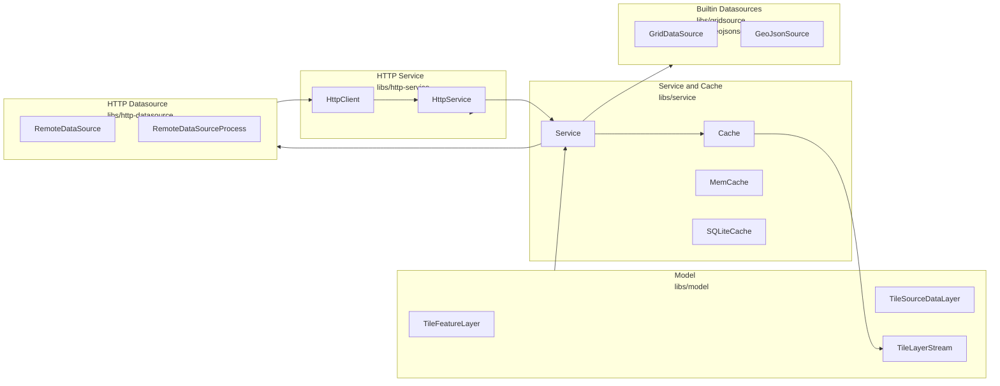
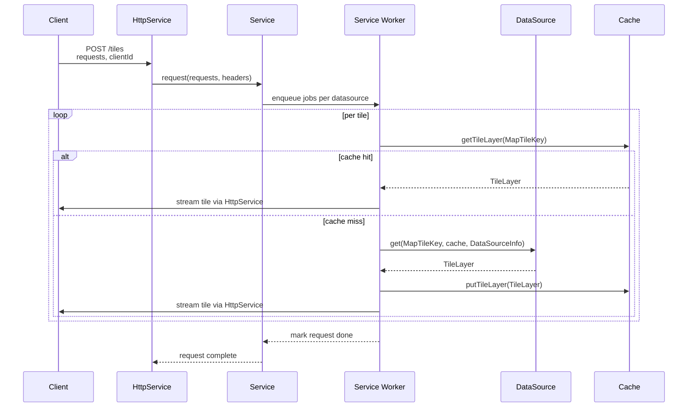

# Mapget Developer Guide

This guide is aimed at contributors and integrators who want to understand how mapget is structured internally, how datasources are implemented and how the HTTP service ties everything together. It assumes familiarity with C++ and basic HTTP concepts. Source code is available at [github.com/ndsev/mapget](https://github.com/ndsev/mapget).

## Component overview

Mapget is split into several libraries that can be combined depending on the use case:

- The **model library** (`libs/model`) defines the feature and tile abstractions and provides simfil integration.
- The **service library** (`libs/service`) manages datasources, workers and caching.
- The **HTTP service library** (`libs/http-service`) exposes the service over HTTP and implements the REST API.
- The **HTTP datasource library** (`libs/http-datasource`) allows datasources to run in separate processes or on remote hosts.
- Optional **datasource libraries** such as `libs/gridsource` and `libs/geojsonsource` implement concrete data providers.

A condensed component diagram looks like this:



The `apps/mapget` executable is a thin wrapper that wires an `HttpService` instance to the command‑line interface and sets up the default datasources based on configuration.

## Development setup

For local development you typically build mapget from source:

```bash
mkdir build && cd build
cmake .. -DCMAKE_BUILD_TYPE=Debug -G Ninja
cmake --build .
ctest
```

This produces a `mapget` binary under `build/apps/mapget` and the shared libraries for the model, service and HTTP layers. The same project can also build a Python wheel if the `MAPGET_WITH_WHEEL` CMake option is enabled.

Useful CMake options include:

| Variable Name | Details   |
| ------------- | --------- |
| `MAPGET_WITH_WHEEL` | Enable mapget Python wheel (output to WHEEL_DEPLOY_DIRECTORY). |
| `MAPGET_WITH_SERVICE` | Enable mapget-service library. Requires threads. |
| `MAPGET_WITH_HTTPLIB` | Enable mapget-http-datasource and mapget-http-service libraries. |
| `MAPGET_ENABLE_TESTING` | Enable testing. |
| `MAPGET_BUILD_EXAMPLES` | Build examples. |

The Python package uses `setuptools_scm` to derive versions from git tags, but that mechanism is largely orthogonal to the C++ build.

## DataSource development interface

The central abstraction for providing map data is the `mapget::DataSource` interface. Any datasource, whether in‑process or remote, implements three key responsibilities:

- reporting its capabilities via `info()`,
- filling feature and source data tiles via `fill(...)`, and
- optionally resolving feature IDs via `locate(...)`.

### DataSource basics

At a high level, a datasource must:

- Return a `DataSourceInfo` object from `info()` that describes:
  - which map it serves (`mapId_`),
  - which layers it provides and their metadata (`LayerInfo` and `FeatureTypeInfo`),
  - how many worker threads the service may run in parallel (`maxParallelJobs_`),
  - whether it is an add‑on datasource (`isAddOn_`).
- Implement `fill(TileFeatureLayer::Ptr const&)` to populate features for a given tile.
- Implement `fill(TileSourceDataLayer::Ptr const&)` if it wants to expose source data tiles; otherwise this method can remain empty.
- Optionally implement `locate(LocateRequest const&)` to resolve external feature IDs to tile locations.

The `get(...)` helper in `DataSource` applies caching on top of these methods. It checks the cache, calls `fill(...)` on a miss and writes the resulting tile back into the cache.

### Built-in datasources

Mapget ships with several datasource implementations:

- `RemoteDataSource` connects to an external `DataSourceServer` over HTTP using `/tiles` and `/locate`.
- `RemoteDataSourceProcess` starts such a server as a child process and proxies all requests.
- `GridDataSource` procedurally generates synthetic tiles based on a YAML configuration entry.
- `GeoJsonSource` reads tiles from a folder of `.geojson` files whose names encode tile IDs.

The C++ example under `examples/cpp/local-datasource` shows how to implement a custom datasource that runs in‑process. The Python example in `examples/python/datasource.py` illustrates how to expose a datasource over HTTP using the Python bindings.

## Service, workers and caching

The `mapget::Service` class orchestrates datasources, caches and worker threads. It presents a simple API to callers:

- `add(DataSource::Ptr)` and `remove(DataSource::Ptr)` manage the set of active datasources.
- `request(std::vector<LayerTilesRequest::Ptr> const&, AuthHeaders)` schedules tile requests.
- `locate(LocateRequest const&)` forwards locate queries to matching datasources.
- `abort(LayerTilesRequest::Ptr const&)` cancels an in‑flight request.
- `info(...)` exposes metadata for all datasources.
- `getStatistics()` returns service‑level statistics for the `/status` endpoint.

Internally the service maintains a shared controller object and a pool of worker threads per datasource. Each worker:

- waits for new jobs in a queue,
- checks the cache for an existing tile,
- calls the datasource’s `get(...)` on a cache miss,
- writes the resulting tile back to the cache, and
- notifies the original `LayerTilesRequest` object as tiles are produced.

Jobs are keyed by `MapTileKey` so that concurrent requests for the same tile can take advantage of a single in‑progress computation. Once a tile finishes, waiting requests can receive the cached result instead of triggering duplicate work.

### Service-level sequence

The following sequence diagram summarises what happens when a client requests tiles through the HTTP service:



If a client supplies a `clientId` in the `/tiles` request, the HTTP layer uses it to track open requests and to implement `/abort`.

## HTTP service internals

`mapget::HttpService` binds the core service to an HTTP server implementation. Its responsibilities are:

- map HTTP endpoints to service calls (`/sources`, `/tiles`, `/abort`, `/status`, `/locate`, `/config`),
- parse JSON requests and build `LayerTilesRequest` objects,
- serialize tile responses as JSONL or binary streams,
- manage per‑client state such as `clientId` for abort handling, and
- provide `/config` as a JSON view on the YAML config file.

### Tile streaming

For `/tiles`, the HTTP layer:

- parses the JSON body to extract `requests`, `stringPoolOffsets` and an optional `clientId`,
- constructs one `LayerTilesRequest` per map–layer combination,
- attaches callbacks that feed results into a shared `HttpTilesRequestState`, and
- sends out each tile as soon as it is produced by the service.

In JSONL mode the response is a sequence of newline‑separated JSON objects. In binary mode the HTTP layer uses `TileLayerStream::Writer` to serialize string pool updates and tile blobs. Binary responses can optionally be compressed using gzip if the client sends `Accept-Encoding: gzip`.

The `/abort` endpoint uses the `clientId` mechanism to cancel all open tile requests for a given client and to prevent further work from being scheduled for them.

### Configuration endpoints

The HTTP service also implements `/config`:

- `GET /config` reads the YAML configuration file, extracts the `sources` and `http-settings` keys, masks any `password` or `api-key` values and returns the result alongside the JSON Schema configured via `--config-schema`.
- `POST /config` validates an incoming JSON document against that schema, merges it back into the YAML file (unmasking secrets) and relies on `DataSourceConfigService` to apply the updated datasource configuration.

These endpoints are guarded by command‑line flags: `--no-get-config` disables the GET endpoint, and `--allow-post-config` enables the POST endpoint. They are primarily intended for configuration editors and admin tools.

## Binary streaming and simfil integration

The model library provides both the binary tile encoding and the simfil query integration:

- `TileLayerStream::Writer` and `TileLayerStream::Reader` handle versioned, type‑tagged messages for string pools and tile layers. Each message starts with a protocol version, a `MessageType` (string pool, feature tile, SourceData tile, end-of-stream), and a payload size.
- `TileFeatureLayer` derives from `simfil::ModelPool` and exposes methods such as `evaluate(...)` and `complete(...)` to run simfil expressions and obtain completion candidates.

String pools are streamed incrementally. The server keeps a `StringPoolOffsetMap` that tracks, for each ongoing tile request, the highest string ID known to a given client per datasource node id. When a tile is written, `TileLayerStream::Writer` compares that offset with the current `StringPool::highest()` value:

- If the client has never seen this node, the writer serialises the full string pool and prepends a `StringPool` message before the first tile message.
- If new strings were added since the last request, the writer serialises only the suffix `[oldHighest+1, highest]` and sends this as a `StringPool` update before the tile.
- Clients attach their current offsets as part of the `/tiles` request; the `TileLayerStream::Reader` merges incoming string pool chunks into a `StringPoolCache` so that subsequent tile messages can reference strings by ID without repeating them.

For persistent caches the writer can be configured with `differentialStringUpdates=false` so that complete string pools are written to disk; for HTTP streaming it is normally enabled to minimise bandwidth.

When used from C++ or from worker processes behind the HTTP API, these facilities allow you to:

- execute complex filter expressions server‑side,
- obtain diagnostics and traces for queries, and
- implement interactive query builders with completion support.

The details of simfil itself are covered in the simfil language and developer guides; from mapget’s perspective it is a powerful query engine attached to the feature model.

## Logging, diagnostics and deployment

For development and operations it is important to understand how to observe a running mapget instance:

- The `/status` endpoint shows JSON dumps of service and cache statistics embedded in a simple HTML page.
- Environment variables such as `MAPGET_LOG_LEVEL`, `MAPGET_LOG_FILE` and `MAPGET_LOG_FILE_MAXSIZE` control logging behaviour and are honoured by both the Python entry point and the native binary.
- Cache statistics expose hit and miss counts, and in memory mode additional metrics about cached tiles.

Deployment is typically centred around the Python package or the CMake build:

- For Python‑centric deployments, `pip install mapget` provides the CLI and Python APIs. You can then run `python -m mapget serve` and pass the same `--config` and cache options as for the C++ binary.
- For C++‑centric deployments, build the project with `MAPGET_WITH_SERVICE` and `MAPGET_WITH_HTTPLIB` enabled, then deploy the `mapget` binary together with its configuration files.

In both cases the actual YAML configuration and datasource executables are under your control, which makes mapget a flexible foundation that can be embedded into many different systems.

## Making mapget releases

The `mapget` Python package is deployed to PyPI through GitHub Actions with automatic version management:

### Release Process

#### Manual Steps:

1. **Update Version**: Before creating a release, update `MAPGET_VERSION` in `CMakeLists.txt` to the new version (e.g., `2025.3.1`)
2. **Commit and Push**: Commit this change to the `main` branch with a clear message like "Bump version to 2025.3.1"
3. **Create GitHub Release**:
  - Go to the repository's "Releases" page on GitHub
  - Click "Create a new release"
  - Set the tag to `v2025.3.1` (matching the CMakeLists.txt version)
  - Select "Create new tag on publish"
  - Fill in release title and notes
  - Publish the release

#### Automated Process:

When the release is published, GitHub Actions will automatically:

- Use `setuptools_scm` to determine the version from the git tag
- Pass this version to CMake during the build process (overriding the default in CMakeLists.txt)
- Validate that the git tag matches the CMakeLists.txt version (release will fail if they don't match)
- Build wheels for all supported platforms (Linux x86_64/aarch64, macOS Intel/ARM, Windows) and Python versions (3.10-3.13)
- Upload the official release to PyPI

### Development Snapshots

Every push to the `main` branch automatically triggers a development release:
- Version is determined by `setuptools_scm` (e.g., `2025.3.0.dev61` for the 61st commit after the last tag)
- Development versions are uploaded to PyPI and can be installed with `pip install mapget --pre`
- No manual intervention required - the version is automatically derived from git history

### Version Management

The system uses a dual approach:
- **CMakeLists.txt**: Contains the base version for local development and must match tagged releases
- **setuptools_scm**: Automatically generates appropriate versions based on git state:
  - Tagged commits: Clean version (e.g., `2025.3.0`)
  - Untagged commits on main: Development version (e.g., `2025.3.0.dev61`)

This ensures clear distinction between official releases and development snapshots on PyPI, while preventing version mismatches through automated validation.
