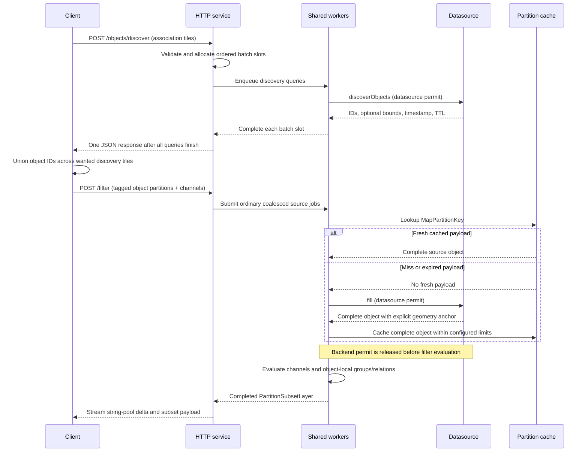
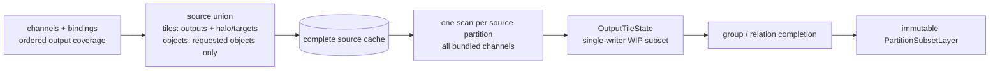

# Mapget Developer Guide

This guide describes the protocol-5 implementation: complete source partitions,
server-evaluated subset layers, semantic geometry names, and lazy attachments.

## Components

- `libs/model` owns `PartitionFeatureLayer`, `PartitionSubsetLayer`,
  `PartitionSourceDataLayer`, feature-model nodes, SIMFIL integration, and the
  binary stream.
- `libs/service` owns datasource registration, complete source-partition caching,
  worker scheduling, object discovery, filtering, cross-tile coordination, locate, and
  attachment routing.
- `libs/http-service` exposes REST and interactive transports.
- `libs/http-datasource` runs datasources in another process/host.
- `libs/geojsonsource` and `libs/gridsource` are built-in providers.
- `libs/pymapget` exposes the same model/service contracts to Python.

`apps/mapget` wires these libraries into the CLI.

## Object datasource integration

Existing tile datasources can keep `fill(TileFeatureLayer::Ptr const&)` and
`fill(TileSourceDataLayer::Ptr const&)`: these are aliases of the generic
partition models. Object-aware fills inspect `layer->partitionId()` and use
`objectId()`; do not call `tileId()` for objects. Publish object addressing and
`tileAssociationLevel` in each relevant `LayerInfo`, including source-data
layers, and choose an explicit geometry anchor before inserting points.

Override `DataSource::discoverObjects(ObjectDiscoveryRequest const&)` to
return an `ObjectDiscoveryResult`. The default reports unavailable, not empty.
It returns associations only; ordinary fills still load object payloads.
Exceptions and invalid result bounds/TTL become failed discovery responses.
The scheduler shares datasource permits and worker threads with tile/object
loads, alternates discovery and payload selection, and cancels queued
association work on invalidation/shutdown. `/status-data` includes
`queued-discovery-jobs` and accounts queued request storage.

Remote/process sources use the same discovery hook through
`DataSourceServer::onObjectDiscoveryRequest`. Their `/objects/discover`
request is a single `{layerId,tileId}` query because the remote endpoint owns
one datasource; the public service endpoint supports map-scoped batches.
Remote `/tile` and `/attachment` accept the URL-encoded tagged `partition`.
Python exposes `PartitionId`, `PartitionKind`, `MapPartitionKey`,
`ObjectDiscoveryRequest`, `ObjectReference`, `ObjectDiscoveryResult`,
`ObjectDiscoveryStatus`, `Client.discover_objects`, and
`DataSourceServer.on_object_discovery_request`. Legacy tile model names refer
to the same Python classes; `Request`/`FilterRequest` accept PackedTileId or
PartitionId values in their existing `tiles` argument.

Feature-ID integer parts use signed int64 in the shared simfil model. For an
object's full uint64 identity, project its bits rather than converting through
a double; use the U64 ID-part declaration so canonical IDs format unsigned.
Native locate implementations return generic partition keys. Optional layer
and partition restrictions prevent guessing when several layers reuse IDs.

### Partition identity and serialization

`PartitionId::tile(TileId)` and `PartitionId::object(uint64_t)` explicitly
distinguish spatial tiles from opaque objects. The tag is never inferred from
the value; object zero and the tile-zero metadata sentinel are distinct.
`tileId()` and `objectId()` reject access through the wrong tag.

`MapPartitionKey` combines payload type, map, layer, and partition identity.
Object keys use `object/` in the final component, for example
`Features:City:Road:object/18446744073709551615`. `id()` and `partitionKey()`
return this generic key. Code accessing the old public `tileId_` member must
use `partitionId_` and its checked accessor. `MapTileKey` and the `Tile*Layer`
names remain aliases of the partition types.

`LayerInfo.partitionKind` defaults to `tile`. Object layers require a
`tileAssociationLevel` in 0..15; tile layers omit it. Before adding object
geometry, call `setGeometryAnchor()` with a real source position. The initial
anchor is (0,0,0); a discovery tile must not supply that anchor.

Object IDs retain all 64 bits in native code and binary streams; JSON encodes
them as unsigned decimal strings. A container-scoped feature-ID part can still
be named `tileId` when its declared type is `U64`. Preserve its bits with
`std::bit_cast<int64_t>(objectId)` in the signed simfil model. Canonical feature
IDs format that part as unsigned; ordinary numeric fields retain the signed
projection and do not provide unsigned arithmetic.

Protocol 5 layer headers carry a partition tag and a 32-bit tile or 64-bit
object ID. Feature GeoJSON includes `partition`; tile exports also retain
`mapgetTileId`. Subset JSON uses `type: "PartitionSubsetLayer"` and tagged
`partition`. Its `sourceTileKey` field carries a generic `MapPartitionKey`.
SourceData JSON remains an array of roots, with partition identity in the
binary header. Readers predating protocol 5 must be upgraded.

Filtered subsets preserve the source legal notice alongside timestamps, TTL,
and diagnostics. `PartitionLayer::setLegalInfo()` takes an optional string;
`std::nullopt` clears it. Python provides `legal_info()` and `set_legal_info()`,
with `None` to clear it. An empty string is still a present notice.

### Discovery and payload lifetime

There are two independent operations, not a new object-loading pipeline:

1. The client queries spatial associations using valid packed tiles at
   `tileAssociationLevel`. `Service::discoverObjects` validates routing,
   authorization, layer kind and level, then queues one discovery job per tile.
   The provider returns object IDs, optional bounds, and association freshness.
2. The client unions those IDs across wanted discovery tiles and sends tagged
   object partitions through `/tiles`, `/filter`, or `/interactive`. Ordinary
   source jobs load/cache complete objects and evaluate any attached filters.

An object has one `MapPartitionKey` per map/layer/payload type regardless of
how many discovery tiles reference it. Discovery neither fills objects nor
creates payload-cache entries. Object payloads use the existing cache and
in-flight coalescing index; discovery queries use neither. String pools remain
datasource-owned. A discovery tile never supplies an object's geometry anchor.

Association `timestamp + ttlMs` and payload `timestamp + ttl` are independent.
The former controls when a client refreshes its spatial associations; the
latter controls cache expiry and payload renewal. Removing an association
does not invalidate a cached object, and a client must retain an object while
another wanted discovery tile still references it. Zero TTL means no expiry
in either case. See the [cache guide](mapget-cache.md#object-partition-caching).


```mermaid
sequenceDiagram
  participant C as Client
  participant H as HTTP service
  participant W as Shared workers
  participant D as Datasource
  participant K as Partition cache
  C->>H: POST /objects/discover (association tiles)
  H->>H: Validate and allocate ordered batch slots
  H->>W: Enqueue discovery queries
  W->>D: discoverObjects (datasource permit)
  D-->>W: IDs, optional bounds, timestamp, TTL
  W-->>H: Complete each batch slot
  H-->>C: One JSON response after all queries finish
  C->>C: Union object IDs across wanted discovery tiles
  C->>H: POST /filter (tagged object partitions + channels)
  H->>W: Submit ordinary coalesced source jobs
  W->>K: Lookup MapPartitionKey
  alt Fresh cached payload
    K-->>W: Complete source object
  else Miss or expired payload
    K-->>W: No fresh payload
    W->>D: fill (datasource permit)
    D-->>W: Complete object with explicit geometry anchor
    W->>K: Cache complete object within configured limits
  end
  Note over W,D: Backend permit is released before filter evaluation
  W->>W: Evaluate channels and object-local groups/relations
  W-->>H: Completed PartitionSubsetLayer
  H-->>C: Stream string-pool delta and subset payload
```

The same payload jobs serve `/tiles` and interactive requests. The diagram
shows `/filter`; discovery is a separate REST exchange in all cases.

### Discovery execution and cancellation

Discovery and payload jobs share the global worker cap and each primary
datasource's concurrency limit. The scheduler alternates job kinds when both
are runnable. There is a service-wide limit of 4096 **pending queries**, not a
memory bound on returned association lists. Discovery has no interactive
session gate, deduplication, or separate worker pool. The public HTTP endpoint
aggregates at most 256 queries and responds only after all have completed.

`Service::discoverObjects` has no completion-thread guarantee:

- Validation/admission failures can call back before submission returns.
- Accepted queries normally call back on the worker executing the provider.
- Map invalidation/shutdown calls back for queued jobs on the thread performing
  that operation; jobs whose source disappeared may also fail on a worker.

Callbacks run outside the scheduler mutex. Capture owned state, synchronize
shared state, and keep callbacks short and nonthrowing. In particular, a
discovery worker retains its datasource permit until the callback returns;
waiting there for another service job can exhaust permits/workers. Payload
jobs, by contrast, release their backend permit before filter evaluation and
consumer callbacks.

There is no per-query cancellation handle, and disconnecting an HTTP client
does not remove its discovery work. Map invalidation/shutdown fails queued
queries but cannot interrupt a running provider call. Running discovery may
still publish associations from the previous catalog state; clients must
discard stale responses. Shutdown joins those calls, so providers need bounded
I/O timeouts. Payload filters retain their existing cooperative cancellation
and output-ownership checks; discovery does not replace that mechanism.

### Runnable object datasource

[`examples/python/object-datasource.py`](../examples/python/object-datasource.py)
serves one synthetic road object near Munich, with a full-range uint64 ID,
explicit anchor, and independent association/payload TTLs. It declares known
empty discovery outside that object's association tiles. It requires only the
mapget Python package and its ndslive-math dependency, not an NDS account.

From a mapget checkout, start the datasource and public service in separate
terminals:

```bash
python examples/python/object-datasource.py --port 9100
```

```bash
mapget serve --host 127.0.0.1 -p 9101 -d 127.0.0.1:9100
```

The datasource prints the discovery tile IDs. To exercise discovery and load
the union of returned objects through the public client:

```python
import mapget
from ndslive.math import PackedTileId

client = mapget.Client("127.0.0.1", 9101)
tile = PackedTileId.from_wgs84(11.57, 48.14, 13)
associations = client.discover_objects(
    mapget.ObjectDiscoveryRequest("ObjectExample", "Road", tile))
if associations.status != mapget.ObjectDiscoveryStatus.SUCCESS:
    raise RuntimeError(associations.message)
partitions = [mapget.PartitionId.object(ref.object_id) for ref in associations.objects]
if partitions:
    for layer in client.request(mapget.Request("ObjectExample", "Road", partitions)):
        print(layer.partition_id().object_id, layer.geojson())
```

Do not feed an object ID to `PackedTileId`, even when it fits in 32 bits.
Python keeps the object ID as an exact integer; JSON transport uses a decimal
string. The example's U64 feature-ID part uses a signed bit projection only at
`new_feature`, not for discovery or `PartitionId.object`.

The executable example is covered by `test-python-object-datasource-example`
(discovery, empty/error responses, JSON and binary object loading, filtering,
and cache reuse). Run it with
`ctest --test-dir build -R '^test-python-object-datasource-example$' --output-on-failure`.

## Development setup

```bash
cmake -S . -B build -G Ninja -DCMAKE_BUILD_TYPE=Debug
cmake --build build
ctest --test-dir build
```

Useful options include `MAPGET_WITH_WHEEL`, `MAPGET_WITH_SERVICE`,
`MAPGET_WITH_HTTPLIB`, `MAPGET_ENABLE_TESTING`, and
`MAPGET_BUILD_EXAMPLES`.

## Datasource contract

A `DataSource`:

- returns `DataSourceInfo` from `info()`;
- fills one complete `TileFeatureLayer` or `TileSourceDataLayer`;
- may implement cheap `locate()` planning for secondary IDs;
- may implement `discoverObjects()` for spatial association lookup on object layers;
- may implement `attachment()` for a named lazy payload.

`DataSource::locate()` returns candidate `MapPartitionKey`s plus a portable
in-partition selector. A selector is either an exact canonical feature ID, a typed and
schema-compiled SIMFIL `featureFilter`, or a typed `featureIdExpression` with
scalar bindings. `featureIdExpression` is evaluated once against the candidate
partition's `$features` view; its returned canonical IDs use the partition's
primary-ID index instead of evaluating a predicate against every feature. Planning must
be side-effect free and must not fetch, fill, or convert a partition. The service
loads every candidate through the ordinary cache/coalesced scheduler, applies
the selector to the complete partition, and only then decides missing versus
ambiguous. The same contract is used by public `/locate`, stored-relation
targets in tile filters, add-on composition, and `RemoteDataSource`. Object
filters deliberately do not expand their source-object boundary.

`DataSourceInfo::stringPoolId_` names the serialized string namespace. The
service catalog separately assigns `sourceId`. Only one primary datasource may
advertise a map; add-ons compose behind it. This constraint keeps
`MapPartitionKey` sufficient for cache and in-flight identity.

There are no stages and no backend feature LOD. Datasources give
geometries stable semantic names. Validities which target a particular
geometry use the same name. A layer-local table represents up to 255 names in
one byte per geometry/reference.

Large GLBs should use `glbAttachmentName`. Keep any AABB/geometry nodes needed
for low-cost rendering decisions in the source tile. If a datasource must
build a GLB to discover those bounds, it may retain the completed bytes and
return them from `attachment()`; the initial contract does not require a more
complex manifest pipeline.

Built-in providers include:

- `RemoteDataSource` / `RemoteDataSourceProcess`;
- `GridDataSource`;
- `GeoJsonSource`.

See `examples/cpp/local-datasource` and `examples/python/datasource.py`.

## Model ownership

`PartitionFeatureLayer` and `PartitionSubsetLayer` both derive from
`PartitionFeatureModelLayerBase`. The base owns compact feature IDs, geometry
columns, source references, and the semantic geometry-name table.

`PartitionSubsetLayer` additionally owns:

- ordered `TileSubsetChannel` roots;
- typed feature, attribute-validity, relation, and group entry columns;
- dependency, issue, trace, and filter-identity data.

The channel aggregate arrays reference entries in layer-owned columns.
Channels provide typed `forEach*Entry` accessors and terminal `scope()`.
Relation rows reference supporting `FeatureEntry` endpoints; there is no
separate endpoint model class.

The value is mutable only while one output state constructs it. Consumers
receive an immutable serialized value. There is intentionally no `seal()`
defensive lifecycle in the initial implementation.

## Service, workers, and cache

The principal service requests are:

- `LayerTilesRequest`;
- `FeatureLayerFilterTilesRequest`;
- `AttachmentRequest`;
- `LocateRequest`;
- `ObjectDiscoveryRequest` (association lookup only).

The tile-named request classes also accept `PartitionId` values; their names
do not select a separate tile-only execution path.

`Service::Impl` composes a ready-source registry and one global
`ServiceScheduler`. All workers are homogeneous: each owns one source partition
through cache/backend loading and every attached direct or filter consumer. A
source's `maxParallelJobs` is a permit limit for backend access rather than a
number of dedicated threads. The payload job releases that permit before it runs
SIMFIL evaluation and result callbacks, allowing another worker to enter the
datasource without retaining the completed tile in a second queue. Add-ons
remain nested in the matching primary partition job and share its concurrency. The
service-wide worker cap is configurable with `--worker-count`; its default is
`clamp(2 * hardware_concurrency, 16, 32)`.

Complete source jobs are admitted in request order and sources are considered
round-robin. A worker claims the next `MapPartitionKey`, coalesces through the
in-flight tile index, reads the cache or invokes the datasource, caches the
complete result, and notifies every waiter.
`priorityPartitions` (or tile-only `priorityTileIds`) promotes requested keys. It does not add
coverage or change data semantics.

Requests may share an atomic work-admission gate which is fixed before
submission. A closed gate keeps that request's unscheduled keys queued while
workers continue with other requests. It does not detach the request from a job
selected for another live consumer, and backpressure does not suppress work
which has already started. Opening a gate calls `Service::notifyWorkAvailable()`
so sleeping workers reconsider the queued keys.

One coalesced source partition may serve ordinary tile consumers and several filter
requests. Those filters run sequentially on the worker that completed the partition,
and each source-local evaluation scatters immutable contributions to every
dependent output. Loaded source models therefore remain bounded by active
workers rather than accumulating in an independent evaluation queue.

Terminal worker failure must erase the in-flight entry and terminally notify
every waiter. A catch path which only logs is a request leak.

### Filter evaluation

`featurelayer-filter.cpp` owns source-local evaluation and deterministic final
materialization. `service-filter.cpp` owns the filter request API plus
`FilterRequestExecution`, including request-wide operators, cancellation, and
publication. The rest of the service implementation is split by ownership:

- `service-datasources.cpp`: ready registry and config-backed catalog lifecycle;
- `service-scheduler.cpp`: global workers, datasource permits, coalescing, and invalidation;
- `service-tiles.cpp`: ordinary tile request methods, tile jobs, add-on composition, and attachments;
- `service-locate.cpp`: locate candidate planning and result assembly;
- `service-discovery.cpp`: discovery routing/validation and submission to the shared scheduler;
- `service-statistics.cpp`: service and memory-accountability snapshots;
- `service.cpp`: the thin public `Service` facade.


```mermaid
flowchart LR
  Definition["channels + bindings<br/>ordered output coverage"]
  Union["source union<br/>tiles: outputs + halo/targets<br/>objects: requested objects only"]
  Cache[(complete source cache)]
  Scan["one scan per source partition<br/>all bundled channels"]
  Output["OutputTileState<br/>single-writer WIP subset"]
  Complete["group / relation completion"]
  Result["immutable PartitionSubsetLayer"]

  Definition --> Union --> Cache --> Scan --> Output --> Complete --> Result
```

Every channel first applies feature type, geometry, and `featureFilter` gates.
It then expands feature/attribute/relation candidates, applies `entryFilter`,
and evaluates projections. `featureFields` always run against the owning
feature; `entryFields` run against the terminal context.

All expressions are schema-compiled. `rewrite` controls only optional
`LayerSchema::normalizeSearchQuery()` processing of `entryFilter`. Native
SIMFIL truthiness is used. A candidate-local error becomes an aggregated
`FilterIssue`; structural/compile failures abort the request. Source tiles
carrying an error also abort with a `Failed` status and the source error text;
they must not be evaluated as successful empty tiles. An expired error tile can
be loaded again after its datasource recovers.

`FilterRequestExecution` owns one bounded `SimfilExpressionCache` for the
request lifetime. Source scans, group/relation completion, and relation-target
selectors share immutable compiled ASTs through that cache, while each
source-local evaluator binds those ASTs to its own environment and retains
runtime lookup plans only for that worker. Cache keys include query/options,
schema identity, and the exact typed request bindings so compilation can be
shared across source tiles without crossing compile-time semantics.

Attribute contexts add `$feature`, `$layer`, `$name`, `$attributeIndex`,
`$hasValidity`, `$validityIndex`, and `$validityCount`.

Projection is scalar: no result becomes null, the first result wins, and
later values are ignored.

### Point groups

The initial group operator is feature-only point-grid grouping. For tile layers, the source
union contains requested output tiles plus the contribution halo. Each source
tile is scanned once in source-major order and publishes immutable
`FeatureLayerPointGroupMember` values to canonical cells.

The output's WIP subset may already contain local rows, but publication waits
for its own source and all required halo contributions. Group completion sorts
members deterministically, exposes the representative feature as root plus
`$features`, and emits representative geometry with all participating feature
IDs. Attribute grouping and multi-input grouping are intentionally deferred.

For object layers, the source union is exactly the requested object set:
there is no spatial halo. Grid membership is still computed from positions,
but each group remains owned by its source object. Members from two objects
never merge merely because they occupy the same grid cell. The output keeps
the source object's anchor and depends only on that object.

### Relations

Stored relation traversal records descriptors while scanning source roots.
For tile layers, missing cross-tile targets are fetched synchronously in sparse one-hop
resolution jobs. A cross-tile endpoint is copied into the origin output as a
supporting feature entry; the target source tile is not automatically another
output.

Target completion only snapshots terminal tile state while holding the filter
request's coordination mutex. Portable selectors are then grouped by target
tile, deduplicated, and evaluated outside that mutex. Their results are cached
for the request so repeated relation descriptors neither rescan the tile nor
block cancellation and unrelated workers behind SIMFIL evaluation.

The relation root is overlaid with `$source`, `$target`, `$twoway`, and
`$relationIndex`. `$relationIndex` is the stable descriptor ordinal within the
source feature.

For tile layers, `mergeTwoway` pairs reverse descriptors:

- exact-root traversal is owned by the selected origin; the first explicit
  root wins if both endpoints are roots;
- generic display uses a permanent south-west endpoint owner;
- if that permanent owner is outside requested coverage, the pair is skipped
  rather than temporarily reassigned;
- cross-layer/level targets normally leave ownership at the source output.

Object layers resolve only intra-object targets. Missing targets do not invoke
locate or schedule another object/tile load, even if another requested object
might contain the feature. Source references remain intact in the complete
model, but unresolved relations do not become drawable subset rows. Generic
two-way ownership compares `(mapId, layerId, partitionId, featureId)` rather
than geographic southwest coordinates; exact-root traversal still belongs to
the selected root. This avoids inventing a spatial owner for opaque IDs.

Request order controls processing. Output stream order may differ.
`filterId + generation + output MapPartitionKey` identifies a semantic output
slot. The generation changes with filter semantics, not viewport movement or
TTL refresh. Interactive clients send complete pending-output snapshots;
mapget preserves overlapping active work and rejects results whose request no
longer owns that output key.

### Construction and cancellation

One `OutputTileState` may own a WIP `TileSubsetLayer`. Its evaluation job
writes local rows. Halo/relation jobs publish descriptors or source
model pointers, never model nodes allocated in arbitrary pools. The last
terminal dependency takes exclusive ownership, appends deterministic
cross-tile rows, and serializes.

Cancellation is cooperative. Check at feature boundaries and in fixed batches
inside very large group/relation loops. Request state remains alive until
in-flight writers return.

## HTTP service

`HttpService` derives from `Service`. Drogon owns network event loops; mapget's
bounded homogeneous workers own blocking datasource and evaluation work.

The `serve` command registers datasource schemas and static mounts first, then
binds the HTTP listener before loading configuration or launching legacy
remote/process datasources. This ordering is a lifecycle boundary: Trantor
terminates the process directly when listener binding fails, so no datasource
constructor thread or child process may be active before `HttpServer::go()`
returns successfully.

- `tiles-http-handler.cpp`: stateless `/tiles` and `/filter`, response
  negotiation, JSONL/binary streaming, gzip, and backpressure.
- `tiles-ws-session.cpp`: atomic `/interactive` pending snapshots,
  output-owner reconciliation, bounded frame queues, TTL-aware handoff
  bookkeeping, string-pool offsets, control/status frames, and
  `/interactive/payload` draining.
- `tiles-request-json.cpp`: canonical request parser shared by both paths.
- `object-discovery-handler.cpp`: bounded, ordered discovery batches; only validation and
  scheduling run on the I/O thread, not datasource discovery.
- `attachment-handler.cpp`: attachment validation, routing, ETags, and
  conditional responses.

Small endpoints such as `/sources`, `/location`, `/locate`, `/status`,
`/status-data`, and `/config` return ordinary responses.

An interactive replacement is the complete set of outputs the client still
needs, not its retained viewport coverage. Reconciliation preserves matching
active requests, reprioritizes matching queued frames, suppresses duplicate
work while lightweight handoff records are current, and prunes omitted output
ownership without holding the session mutex during service cancellation.
Indexed chunks are staged until the final chunk so a partial envelope cannot
temporarily cancel work named later in the same logical snapshot.

Complete snapshots enter a per-session latest-wins mailbox. A small shared
control executor performs potentially expensive request expansion and
reconciliation away from Drogon's I/O threads, while each session admits at
most one executor task and therefore remains serialized. Replacing an
unapplied mailbox value is safe because every completed envelope describes
full replacement state. Expansion also checks for a newer sequence before its
atomic commit, bounding stale request churn without introducing a second
tile-work queue.

Filter pruning maintains an atomic count of pending outputs per source tile.
The source-local SIMFIL cancellation probe reads that count without taking the
request coordination mutex, so an evaluation whose outputs were all removed
can stop at its next cooperative boundary. Any partial result is discarded
before contribution commit.

The interactive outbox limits are soft admission watermarks, not result-drop
limits. Crossing either watermark closes that session's backend work gate;
workers never wait for `/interactive/payload`. Results from work already in
flight or shared with another session are still queued, so the outbox may
temporarily exceed a watermark. Draining below both limits reopens the gate.

When a tile frame leaves the outbox, the session retains only its key
and optional absolute semantic expiry from `timestamp + ttl`; it never retains
a second payload copy. A later omission clears that handoff. An expired
handoff no longer suppresses an ordinary repeated request, while a missing or
zero TTL relies on omission or connection teardown.

## Binary streaming and string pools

`TileLayerStream` uses versioned VTLV messages for:

- string-pool updates;
- complete feature/source-data layers;
- subset layers;
- request context/status/catalog controls;
- end of stream.

Protocol 5 encodes a partition-kind tag followed by a 32-bit tile ID or a
64-bit object ID in the common layer header. This breaks binary compatibility
for tile payloads too: aliases and legacy JSON request fields do not preserve
the old binary layout. Readers/writers must use matching protocol versions.
The subset prelude has no delivery epoch (removed in protocol 4).

HTTP clients send the highest known string ID per `stringPoolId`. Writers emit
only the missing suffix; readers merge it into `StringPoolCache`. Persistent
caches use self-contained string data as configured.

The `TileSubsetLayer` prelude follows the ordinary `TileLayer` base bytes and
contains `filterId` and generation, so routing metadata can be read without
constructing every model node.

## Configuration endpoints

`GET /config` returns schema, masked datasource model, read-only state, and
registered public sections. `--allow-post-config` enables configuration writes:
`POST /config` validates and replaces the datasource model, while
revision-guarded `PATCH /config` dispatches one opaque path and complete value
to an exact `PublicConfigFieldWriter` registered by the embedding application.
Both preserve unrelated public YAML; field PATCH does not reload datasources.

## Logging and diagnostics

- `/status` renders a live dashboard backed by `/status-data`.
- `MAPGET_LOG_LEVEL`, `MAPGET_LOG_FILE`, and
  `MAPGET_LOG_FILE_MAXSIZE` configure logging.
- Service/cache and interactive queue metrics are available in status data.

## Releases

On `release/X.Y.Z`, set `MAPGET_VERSION` in `CMakeLists.txt` to `X.Y.Z`.
Merge the green release PR to `main`, wait for `CI and Deploy`, then run the
manual `Create Release` workflow from `main`. Enter the version without `v`.

The guarded workflow validates the CMake version and successful `main` CI,
creates `vX.Y.Z`, and dispatches the wheel matrix. `setuptools_scm` supplies
tagged and development versions. Release PRs publish unique development
previews such as `2026.3.5.dev31001`; ordinary `main` pushes build but do not
upload another snapshot.
