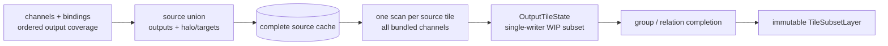

# Mapget Developer Guide

This guide describes the protocol-3 implementation: complete source tiles,
server-evaluated subset layers, semantic geometry names, and lazy attachments.

## Components

- `libs/model` owns `TileFeatureLayer`, `TileSubsetLayer`,
  `TileSourceDataLayer`, feature-model nodes, SIMFIL integration, and the
  binary stream.
- `libs/service` owns datasource registration, complete source-tile caching,
  worker scheduling, filtering, cross-tile coordination, locate, and
  attachment routing.
- `libs/http-service` exposes REST and interactive transports.
- `libs/http-datasource` runs datasources in another process/host.
- `libs/geojsonsource` and `libs/gridsource` are built-in providers.
- `libs/pymapget` exposes the same model/service contracts to Python.

`apps/mapget` wires these libraries into the CLI.

## Development setup

```bash
cmake -S . -B build -G Ninja -DCMAKE_BUILD_TYPE=Debug
cmake --build build
ctest --test-dir build
```

Useful options include `MAPGET_WITH_WHEEL`, `MAPGET_WITH_SERVICE`,
`MAPGET_WITH_HTTPLIB`, `MAPGET_ENABLE_TESTING`, and
`MAPGET_BUILD_EXAMPLES`.

## Datasource contract

A `DataSource`:

- returns `DataSourceInfo` from `info()`;
- fills one complete `TileFeatureLayer` or `TileSourceDataLayer`;
- may implement `locate()` for secondary IDs;
- may implement `attachment()` for a named lazy payload.

`DataSourceInfo::stringPoolId_` names the serialized string namespace. The
service catalog separately assigns `sourceId`. Only one primary datasource may
advertise a map; add-ons compose behind it. This constraint keeps
`MapTileKey` sufficient for cache and in-flight identity.

Protocol 3 has no stages and no backend feature LOD. Datasources give
geometries stable semantic names. Validities which target a particular
geometry use the same name. A layer-local table represents up to 255 names in
one byte per geometry/reference.

Large GLBs should use `glbAttachmentName`. Keep any AABB/geometry nodes needed
for low-cost rendering decisions in the source tile. If a datasource must
build a GLB to discover those bounds, it may retain the completed bytes and
return them from `attachment()`; the initial contract does not require a more
complex manifest pipeline.

Built-in providers include:

- `RemoteDataSource` / `RemoteDataSourceProcess`;
- `GridDataSource`;
- `GeoJsonSource`.

See `examples/cpp/local-datasource` and `examples/python/datasource.py`.

## Model ownership

`TileFeatureLayer` and `TileSubsetLayer` both derive from
`TileFeatureModelLayerBase`. The base owns compact feature IDs, geometry
columns, source references, and the semantic geometry-name table.

`TileSubsetLayer` additionally owns:

- ordered `TileSubsetChannel` roots;
- typed feature, attribute-validity, relation, and group entry columns;
- dependency, issue, trace, and filter-identity data.

The channel aggregate arrays reference entries in layer-owned columns.
Channels provide typed `forEach*Entry` accessors and terminal `scope()`.
Relation rows reference supporting `FeatureEntry` endpoints; there is no
separate endpoint model class.

The value is mutable only while one output state constructs it. Consumers
receive an immutable serialized value. There is intentionally no `seal()`
defensive lifecycle in the initial implementation.

## Service, workers, and cache

The principal service requests are:

- `LayerTilesRequest`;
- `FeatureLayerFilterTilesRequest`;
- `AttachmentRequest`;
- `LocateRequest`.

Complete source jobs are processed in request order. A worker claims the next
`MapTileKey`, coalesces through `jobsInProgress_`, reads the cache or invokes
the datasource, caches the complete result, and notifies every waiter.
`priorityTileIds` promotes keys already in the request. It does not add
coverage or change data semantics.

Terminal worker failure must erase the in-flight entry and terminally notify
every waiter. A catch path which only logs is a request leak.

### Filter evaluation

`featurelayer-filter.cpp` owns source-local evaluation and deterministic final
materialization. `service.cpp` owns ordered source scheduling, request-wide
operators, cancellation, and publication.


```mermaid
flowchart LR
  Definition["channels + bindings<br/>ordered output coverage"]
  Union["source union<br/>outputs + halo/targets"]
  Cache[(complete source cache)]
  Scan["one scan per source tile<br/>all bundled channels"]
  Output["OutputTileState<br/>single-writer WIP subset"]
  Complete["group / relation completion"]
  Result["immutable TileSubsetLayer"]

  Definition --> Union --> Cache --> Scan --> Output --> Complete --> Result
```

Every channel first applies feature type, geometry, and `featureFilter` gates.
It then expands feature/attribute/relation candidates, applies `entryFilter`,
and evaluates projections. `featureFields` always run against the owning
feature; `entryFields` run against the terminal context.

All expressions are schema-compiled. `rewrite` controls only optional
`LayerSchema::normalizeSearchQuery()` processing of `entryFilter`. Native
SIMFIL truthiness is used. A candidate-local error becomes an aggregated
`FilterIssue`; structural/compile failures abort the request.

Attribute contexts add `$feature`, `$layer`, `$name`, `$attributeIndex`,
`$hasValidity`, `$validityIndex`, and `$validityCount`.

Projection is scalar: no result becomes null, the first result wins, and
later values are ignored.

### Point groups

The initial group operator is feature-only point-grid grouping. The source
union contains requested output tiles plus the contribution halo. Each source
tile is scanned once in source-major order and publishes immutable
`FeatureLayerPointGroupMember` values to canonical cells.

The output's WIP subset may already contain local rows, but publication waits
for its own source and all required halo contributions. Group completion sorts
members deterministically, exposes the representative feature as root plus
`$features`, and emits representative geometry with all participating feature
IDs. Attribute grouping and multi-input grouping are intentionally deferred.

### Relations

Stored relation traversal records descriptors while scanning source roots.
Missing cross-tile targets are fetched synchronously in sparse one-hop
resolution jobs. A cross-tile endpoint is copied into the origin output as a
supporting feature entry; the target source tile is not automatically another
output.

The relation root is overlaid with `$source`, `$target`, `$twoway`, and
`$relationIndex`. `$relationIndex` is the stable descriptor ordinal within the
source feature.

`mergeTwoway` pairs reverse descriptors:

- exact-root traversal is owned by the selected origin; the first explicit
  root wins if both endpoints are roots;
- generic display uses a permanent south-west endpoint owner;
- if that permanent owner is outside requested coverage, the pair is skipped
  rather than temporarily reassigned;
- cross-layer/level targets normally leave ownership at the source output.

Request order controls processing. Output stream order may differ.
`filterId + generation + output MapTileKey` identifies a semantic output
slot; there is no content/request fingerprint. Viewport coverage amendments
retain the generation, reject frames outside current coverage, and rely on the
interactive envelope `requestId` to suppress stale status messages.

### Construction and cancellation

One `OutputTileState` may own a WIP `TileSubsetLayer`. The output's own source
worker writes local rows. Halo/relation workers publish descriptors or source
model pointers, never model nodes allocated in arbitrary pools. The last
terminal dependency takes exclusive ownership, appends deterministic
cross-tile rows, and serializes.

Cancellation is cooperative. Check at feature boundaries and in fixed batches
inside very large group/relation loops. Request state remains alive until
in-flight writers return.

## HTTP service

`HttpService` derives from `Service`. Drogon owns network event loops; mapget
workers own blocking datasource and evaluation work.

- `tiles-http-handler.cpp`: stateless `/tiles` and `/filter`, response
  negotiation, JSONL/binary streaming, gzip, and backpressure.
- `tiles-ws-session.cpp`: `/interactive` replacements, bounded frame queues,
  string-pool offsets, control/status frames, and
  `/interactive/payload` draining.
- `tiles-request-json.cpp`: canonical request parser shared by both paths.
- `attachment-handler.cpp`: attachment validation, routing, ETags, and
  conditional responses.

Small endpoints such as `/sources`, `/location`, `/locate`, `/status`,
`/status-data`, and `/config` return ordinary responses.

An interactive replacement aborts obsolete backend work and suppresses queued
stale subset frames. Removing and later re-adding an output tile in the same
semantic generation may produce a new value for that tile.

## Binary streaming and string pools

`TileLayerStream` uses versioned VTLV messages for:

- string-pool updates;
- complete feature/source-data layers;
- subset layers;
- request context/status/catalog controls;
- end of stream.

Protocol 3 is a clean major break: stage/LOD/search-result blobs cannot be
partially interpreted.

HTTP clients send the highest known string ID per `stringPoolId`. Writers emit
only the missing suffix; readers merge it into `StringPoolCache`. Persistent
caches use self-contained string data as configured.

The `TileSubsetLayer` prelude follows the ordinary `TileLayer` base bytes and
contains `filterId` and generation, so routing metadata can be read without
constructing every model node.

## Configuration endpoints

`GET /config` returns schema, masked datasource model, read-only state, and
registered public sections. `POST /config` is enabled by
`--allow-post-config`, validates against the active schema, preserves secrets
represented by masked tokens and unknown/public YAML sections, writes the
model, and reloads datasources.

## Logging and diagnostics

- `/status` renders a live dashboard backed by `/status-data`.
- `MAPGET_LOG_LEVEL`, `MAPGET_LOG_FILE`, and
  `MAPGET_LOG_FILE_MAXSIZE` configure logging.
- Service/cache and interactive queue metrics are available in status data.

## Releases

On `release/X.Y.Z`, set `MAPGET_VERSION` in `CMakeLists.txt` to `X.Y.Z`.
Merge the green release PR to `main`, wait for `CI and Deploy`, then run the
manual `Create Release` workflow from `main`. Enter the version without `v`.

The guarded workflow validates the CMake version and successful `main` CI,
creates `vX.Y.Z`, and dispatches the wheel matrix. `setuptools_scm` supplies
tagged and development versions. Release PRs publish unique development
previews such as `2026.3.5.dev31001`; ordinary `main` pushes build but do not
upload another snapshot.
