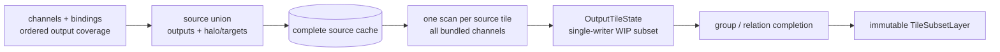

# Mapget Developer Guide

This guide describes the protocol-3 implementation: complete source tiles,
server-evaluated subset layers, semantic geometry names, and lazy attachments.

## Components

- `libs/model` owns `TileFeatureLayer`, `TileSubsetLayer`,
  `TileSourceDataLayer`, feature-model nodes, SIMFIL integration, and the
  binary stream.
- `libs/service` owns datasource registration, complete source-tile caching,
  worker scheduling, filtering, cross-tile coordination, locate, and
  attachment routing.
- `libs/http-service` exposes REST and interactive transports.
- `libs/http-datasource` runs datasources in another process/host.
- `libs/geojsonsource` and `libs/gridsource` are built-in providers.
- `libs/pymapget` exposes the same model/service contracts to Python.

`apps/mapget` wires these libraries into the CLI.

## Development setup

```bash
cmake -S . -B build -G Ninja -DCMAKE_BUILD_TYPE=Debug
cmake --build build
ctest --test-dir build
```

Useful options include `MAPGET_WITH_WHEEL`, `MAPGET_WITH_SERVICE`,
`MAPGET_WITH_HTTPLIB`, `MAPGET_ENABLE_TESTING`, and
`MAPGET_BUILD_EXAMPLES`.

## Datasource contract

A `DataSource`:

- returns `DataSourceInfo` from `info()`;
- fills one complete `TileFeatureLayer` or `TileSourceDataLayer`;
- may implement cheap `locate()` planning for secondary IDs;
- may implement `attachment()` for a named lazy payload.

`DataSource::locate()` returns candidate `MapTileKey`s plus a portable in-tile
selector. A selector is either an exact canonical feature ID, a typed and
schema-compiled SIMFIL `featureFilter`, or a typed `featureIdExpression` with
scalar bindings. `featureIdExpression` is evaluated once against the candidate
tile's `$features` view; its returned canonical IDs use the tile's primary-ID
index instead of evaluating a predicate against every feature. Planning must
be side-effect free and must not fetch, fill, or convert a tile. The service
loads every candidate through the ordinary cache/coalesced scheduler, applies
the selector to the complete tile, and only then decides missing versus
ambiguous. The same contract is used by public `/locate`, stored-relation
targets, add-on composition, and `RemoteDataSource`.

`DataSourceInfo::stringPoolId_` names the serialized string namespace. The
service catalog separately assigns `sourceId`. Only one primary datasource may
advertise a map; add-ons compose behind it. This constraint keeps
`MapTileKey` sufficient for cache and in-flight identity.

Protocol 3 has no stages and no backend feature LOD. Datasources give
geometries stable semantic names. Validities which target a particular
geometry use the same name. A layer-local table represents up to 255 names in
one byte per geometry/reference.

Large GLBs should use `glbAttachmentName`. Keep any AABB/geometry nodes needed
for low-cost rendering decisions in the source tile. If a datasource must
build a GLB to discover those bounds, it may retain the completed bytes and
return them from `attachment()`; the initial contract does not require a more
complex manifest pipeline.

Built-in providers include:

- `RemoteDataSource` / `RemoteDataSourceProcess`;
- `GridDataSource`;
- `GeoJsonSource`.

See `examples/cpp/local-datasource` and `examples/python/datasource.py`.

## Model ownership

`TileFeatureLayer` and `TileSubsetLayer` both derive from
`TileFeatureModelLayerBase`. The base owns compact feature IDs, geometry
columns, source references, and the semantic geometry-name table.

`TileSubsetLayer` additionally owns:

- ordered `TileSubsetChannel` roots;
- typed feature, attribute-validity, relation, and group entry columns;
- dependency, issue, trace, and filter-identity data.

The channel aggregate arrays reference entries in layer-owned columns.
Channels provide typed `forEach*Entry` accessors and terminal `scope()`.
Relation rows reference supporting `FeatureEntry` endpoints; there is no
separate endpoint model class.

The value is mutable only while one output state constructs it. Consumers
receive an immutable serialized value. There is intentionally no `seal()`
defensive lifecycle in the initial implementation.

## Service, workers, and cache

The principal service requests are:

- `LayerTilesRequest`;
- `FeatureLayerFilterTilesRequest`;
- `AttachmentRequest`;
- `LocateRequest`.

`Service::Impl` composes a ready-source registry and one global
`ServiceScheduler`. All workers are homogeneous: each owns one source tile
through cache/backend loading and every attached direct or filter consumer. A
source's `maxParallelJobs` is a permit limit for backend access rather than a
number of dedicated threads. The tile job releases that permit before it runs
SIMFIL evaluation and result callbacks, allowing another worker to enter the
datasource without retaining the completed tile in a second queue. Add-ons
remain nested in the matching primary tile job and share its concurrency. The
service-wide worker cap is configurable with `--worker-count`; its default is
`clamp(2 * hardware_concurrency, 16, 32)`.

Complete source jobs are admitted in request order and sources are considered
round-robin. A worker claims the next `MapTileKey`, coalesces through the
in-flight tile index, reads the cache or invokes the datasource, caches the
complete result, and notifies every waiter.
`priorityTileIds` promotes keys already in the request. It does not add
coverage or change data semantics.

Requests may share an atomic work-admission gate which is fixed before
submission. A closed gate keeps that request's unscheduled keys queued while
workers continue with other requests. It does not detach the request from a job
selected for another live consumer, and backpressure does not suppress work
which has already started. Opening a gate calls `Service::notifyWorkAvailable()`
so sleeping workers reconsider the queued keys.

One coalesced source tile may serve ordinary tile consumers and several filter
requests. Those filters run sequentially on the worker that completed the tile,
and each source-local evaluation scatters immutable contributions to every
dependent output. Loaded source models therefore remain bounded by active
workers rather than accumulating in an independent evaluation queue.

Terminal worker failure must erase the in-flight entry and terminally notify
every waiter. A catch path which only logs is a request leak.

### Filter evaluation

`featurelayer-filter.cpp` owns source-local evaluation and deterministic final
materialization. `service-filter.cpp` owns the filter request API plus
`FilterRequestExecution`, including request-wide operators, cancellation, and
publication. The rest of the service implementation is split by ownership:

- `service-datasources.cpp`: ready registry and config-backed catalog lifecycle;
- `service-scheduler.cpp`: global workers, datasource permits, coalescing, and invalidation;
- `service-tiles.cpp`: ordinary tile request methods, tile jobs, add-on composition, and attachments;
- `service-locate.cpp`: locate candidate planning and result assembly;
- `service-statistics.cpp`: service and memory-accountability snapshots;
- `service.cpp`: the thin public `Service` facade.


```mermaid
flowchart LR
  Definition["channels + bindings<br/>ordered output coverage"]
  Union["source union<br/>outputs + halo/targets"]
  Cache[(complete source cache)]
  Scan["one scan per source tile<br/>all bundled channels"]
  Output["OutputTileState<br/>single-writer WIP subset"]
  Complete["group / relation completion"]
  Result["immutable TileSubsetLayer"]

  Definition --> Union --> Cache --> Scan --> Output --> Complete --> Result
```

Every channel first applies feature type, geometry, and `featureFilter` gates.
It then expands feature/attribute/relation candidates, applies `entryFilter`,
and evaluates projections. `featureFields` always run against the owning
feature; `entryFields` run against the terminal context.

All expressions are schema-compiled. `rewrite` controls only optional
`LayerSchema::normalizeSearchQuery()` processing of `entryFilter`. Native
SIMFIL truthiness is used. A candidate-local error becomes an aggregated
`FilterIssue`; structural/compile failures abort the request.

`FilterRequestExecution` owns one bounded `SimfilExpressionCache` for the
request lifetime. Source scans, group/relation completion, and relation-target
selectors share immutable compiled ASTs through that cache, while each
source-local evaluator binds those ASTs to its own environment and retains
runtime lookup plans only for that worker. Cache keys include query/options,
schema identity, and the exact typed request bindings so compilation can be
shared across source tiles without crossing compile-time semantics.

Attribute contexts add `$feature`, `$layer`, `$name`, `$attributeIndex`,
`$hasValidity`, `$validityIndex`, and `$validityCount`.

Projection is scalar: no result becomes null, the first result wins, and
later values are ignored.

### Point groups

The initial group operator is feature-only point-grid grouping. The source
union contains requested output tiles plus the contribution halo. Each source
tile is scanned once in source-major order and publishes immutable
`FeatureLayerPointGroupMember` values to canonical cells.

The output's WIP subset may already contain local rows, but publication waits
for its own source and all required halo contributions. Group completion sorts
members deterministically, exposes the representative feature as root plus
`$features`, and emits representative geometry with all participating feature
IDs. Attribute grouping and multi-input grouping are intentionally deferred.

### Relations

Stored relation traversal records descriptors while scanning source roots.
Missing cross-tile targets are fetched synchronously in sparse one-hop
resolution jobs. A cross-tile endpoint is copied into the origin output as a
supporting feature entry; the target source tile is not automatically another
output.

Target completion only snapshots terminal tile state while holding the filter
request's coordination mutex. Portable selectors are then grouped by target
tile, deduplicated, and evaluated outside that mutex. Their results are cached
for the request so repeated relation descriptors neither rescan the tile nor
block cancellation and unrelated workers behind SIMFIL evaluation.

The relation root is overlaid with `$source`, `$target`, `$twoway`, and
`$relationIndex`. `$relationIndex` is the stable descriptor ordinal within the
source feature.

`mergeTwoway` pairs reverse descriptors:

- exact-root traversal is owned by the selected origin; the first explicit
  root wins if both endpoints are roots;
- generic display uses a permanent south-west endpoint owner;
- if that permanent owner is outside requested coverage, the pair is skipped
  rather than temporarily reassigned;
- cross-layer/level targets normally leave ownership at the source output.

Request order controls processing. Output stream order may differ.
`filterId + generation + output MapTileKey` identifies a semantic output
slot. The generation changes with filter semantics, not viewport movement or
TTL refresh. Interactive clients send complete pending-output snapshots;
mapget preserves overlapping active work and rejects results whose request no
longer owns that output key.

### Construction and cancellation

One `OutputTileState` may own a WIP `TileSubsetLayer`. Its evaluation job
writes local rows. Halo/relation jobs publish descriptors or source
model pointers, never model nodes allocated in arbitrary pools. The last
terminal dependency takes exclusive ownership, appends deterministic
cross-tile rows, and serializes.

Cancellation is cooperative. Check at feature boundaries and in fixed batches
inside very large group/relation loops. Request state remains alive until
in-flight writers return.

## HTTP service

`HttpService` derives from `Service`. Drogon owns network event loops; mapget's
bounded homogeneous workers own blocking datasource and evaluation work.

The `serve` command registers datasource schemas and static mounts first, then
binds the HTTP listener before loading configuration or launching legacy
remote/process datasources. This ordering is a lifecycle boundary: Trantor
terminates the process directly when listener binding fails, so no datasource
constructor thread or child process may be active before `HttpServer::go()`
returns successfully.

- `tiles-http-handler.cpp`: stateless `/tiles` and `/filter`, response
  negotiation, JSONL/binary streaming, gzip, and backpressure.
- `tiles-ws-session.cpp`: atomic `/interactive` pending snapshots,
  output-owner reconciliation, bounded frame queues, TTL-aware handoff
  bookkeeping, string-pool offsets, control/status frames, and
  `/interactive/payload` draining.
- `tiles-request-json.cpp`: canonical request parser shared by both paths.
- `attachment-handler.cpp`: attachment validation, routing, ETags, and
  conditional responses.

Small endpoints such as `/sources`, `/location`, `/locate`, `/status`,
`/status-data`, and `/config` return ordinary responses.

An interactive replacement is the complete set of outputs the client still
needs, not its retained viewport coverage. Reconciliation preserves matching
active requests, reprioritizes matching queued frames, suppresses duplicate
work while lightweight handoff records are current, and prunes omitted output
ownership without holding the session mutex during service cancellation.
Indexed chunks are staged until the final chunk so a partial envelope cannot
temporarily cancel work named later in the same logical snapshot.

Complete snapshots enter a per-session latest-wins mailbox. A small shared
control executor performs potentially expensive request expansion and
reconciliation away from Drogon's I/O threads, while each session admits at
most one executor task and therefore remains serialized. Replacing an
unapplied mailbox value is safe because every completed envelope describes
full replacement state. Expansion also checks for a newer sequence before its
atomic commit, bounding stale request churn without introducing a second
tile-work queue.

Filter pruning maintains an atomic count of pending outputs per source tile.
The source-local SIMFIL cancellation probe reads that count without taking the
request coordination mutex, so an evaluation whose outputs were all removed
can stop at its next cooperative boundary. Any partial result is discarded
before contribution commit.

The interactive outbox limits are soft admission watermarks, not result-drop
limits. Crossing either watermark closes that session's backend work gate;
workers never wait for `/interactive/payload`. Results from work already in
flight or shared with another session are still queued, so the outbox may
temporarily exceed a watermark. Draining below both limits reopens the gate.

When a tile frame leaves the outbox, the session retains only its key
and optional absolute semantic expiry from `timestamp + ttl`; it never retains
a second payload copy. A later omission clears that handoff. An expired
handoff no longer suppresses an ordinary repeated request, while a missing or
zero TTL relies on omission or connection teardown.

## Binary streaming and string pools

`TileLayerStream` uses versioned VTLV messages for:

- string-pool updates;
- complete feature/source-data layers;
- subset layers;
- request context/status/catalog controls;
- end of stream.

Protocol 4 is a clean major break: it removes the serialized subset delivery
epoch introduced during protocol 3 development. Older subset payloads cannot
be partially interpreted.

HTTP clients send the highest known string ID per `stringPoolId`. Writers emit
only the missing suffix; readers merge it into `StringPoolCache`. Persistent
caches use self-contained string data as configured.

The `TileSubsetLayer` prelude follows the ordinary `TileLayer` base bytes and
contains `filterId` and generation, so routing metadata can be read without
constructing every model node.

## Configuration endpoints

`GET /config` returns schema, masked datasource model, read-only state, and
registered public sections. `--allow-post-config` enables configuration writes:
`POST /config` validates and replaces the datasource model, while
revision-guarded `PATCH /config` dispatches one opaque path and complete value
to an exact `PublicConfigFieldWriter` registered by the embedding application.
Both preserve unrelated public YAML; field PATCH does not reload datasources.

## Logging and diagnostics

- `/status` renders a live dashboard backed by `/status-data`.
- `MAPGET_LOG_LEVEL`, `MAPGET_LOG_FILE`, and
  `MAPGET_LOG_FILE_MAXSIZE` configure logging.
- Service/cache and interactive queue metrics are available in status data.

## Releases

On `release/X.Y.Z`, set `MAPGET_VERSION` in `CMakeLists.txt` to `X.Y.Z`.
Merge the green release PR to `main`, wait for `CI and Deploy`, then run the
manual `Create Release` workflow from `main`. Enter the version without `v`.

The guarded workflow validates the CMake version and successful `main` CI,
creates `vX.Y.Z`, and dispatches the wheel matrix. `setuptools_scm` supplies
tagged and development versions. Release PRs publish unique development
previews such as `2026.3.5.dev31001`; ordinary `main` pushes build but do not
upload another snapshot.
