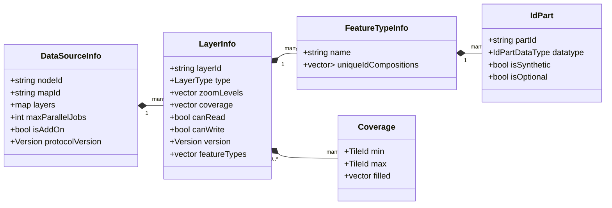
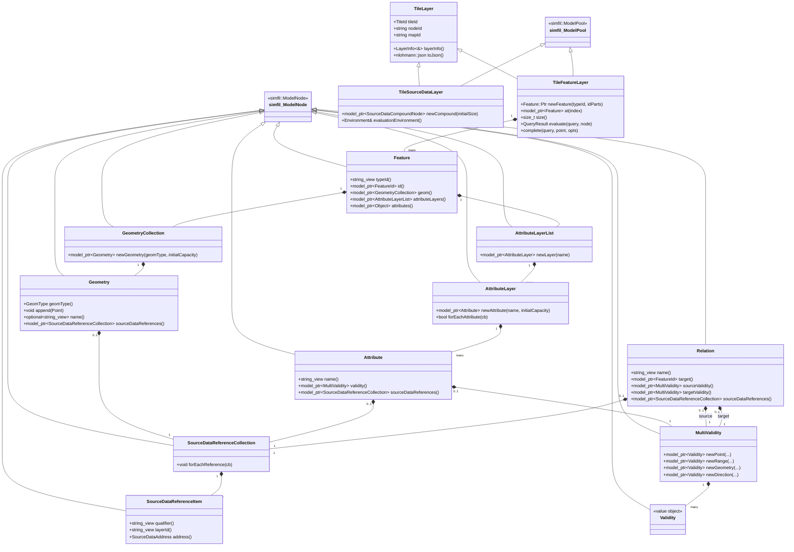

# Layered Data Model

Mapget represents all map content as tiles of structured features. This document gives a conceptual overview of that model so that you can interpret API responses, design datasources and reason about performance. 

## Features and properties

The atomic unit of data in mapget is the feature. Conceptually, a feature is close to a GeoJSON feature: it has a unique identifier, one or more geometries and a flexible set of attributes. Mapget adds two ideas on top of plain GeoJSON:

- layered attributes with their own validity information, and
- explicit relations and source data references.

The `properties.layers` tree in a feature holds these layered attributes and their validity arrays, while top-level entries under `properties` are regular attributes without layering.

To make this as fast as possible, mapget uses the simfil binary format with a small VTLV (Version-Type-Length-Value) message wrapper. This is explained in the following section.

## Datasource metadata

Tiles do not exist in isolation: each datasource publishes metadata that tells clients which maps and layers are available, which feature types exist inside a layer and how feature IDs are structured. The same metadata is exposed over `/sources` and used internally when parsing binary tiles.



- **`DataSourceInfo`** identifies the datasource node, the map ID that node serves, all attached layers and operational limits such as `maxParallelJobs`. When a datasource is marked as `isAddOn`, the service chains it behind the main datasource for the same map.
- **`LayerInfo`** describes a single layer: type (`Features` or `SourceData`), zoom levels, coverage rectangles, read/write flags and the semantic version. The service uses this to validate client requests, and the reader/writer uses it when parsing tile streams.
- **`FeatureTypeInfo`** and **`IdPart`** list the allowed unique ID compositions per feature type, which is why clients can rely on the ID schemes described earlier.
- **`Coverage`** entries describe filled tile ranges so that caches and clients can reason about availability without probing every tile if a dataset is sparse.

When a tile is parsed from the binary stream, the reader calls a `LayerInfoResolveFun` to obtain the matching `LayerInfo` and uses it to validate feature IDs and field layouts. When a client queries `/sources`, it receives the same structures in JSON form, enabling dynamic discovery of map contents.

### Add‑on datasources

Add‑on datasources are registered with `isAddOn` and must share the same `mapId` (and layer IDs) as the base datasource they extend. The service registers them without their own worker threads and evaluates them only while serving feature tiles from the base datasource:

- Clients request tiles for the base datasource map ID. When a base feature tile is loaded, the service also fetches the matching tile (same map, layer, and tile ID) from every add‑on datasource.
- The base tile is re-encoded into a combined string pool so that strings introduced by the add‑on tile can be referenced.
- Features from the add‑on tile are cloned into the base tile: attributes, attribute layers, geometries, and relations are merged into matching base features; if no match exists, a new feature is created in the base tile.
- If an add‑on feature uses secondary IDs, the service issues a `locate` call against the base datasource to resolve them to primary IDs before merging.
- Only feature layers participate in this overlay path; add‑ons cannot introduce standalone maps or layers that are not already present in the base datasource metadata.

Clients see both base and add‑on entries in the `/sources` response (add‑ons are marked `isAddOn`), but the base datasource remains the entry point for tile requests. This mechanism is used by Python LiveSource overlays that attach Road and Lane attribute layers to an existing NDS.Live or NDS.Classic base map.

## Feature IDs

Every feature in mapget is uniquely identified by a composite ID. Logically, it is made up of:

- `typeId`: a feature type identifier such as `Road` or `Building`.
- One or more ID parts that together distinguish one feature from all others of that type.

In JSON, the full ID is exposed as a string:

```json
{ "id": "Road.1234.7" }
```

The exact composition of the ID parts is defined per feature type in the metadata (`FeatureTypeInfo`). Mapget supports multiple ID compositions per type: the primary composition is used in stored features, while secondary compositions can be used for references or for resolving external identifiers via the `/locate` endpoint. For example, a `Road` type might declare the following compositions:

```yaml
uniqueIdCompositions:
  -  # primary, used for stored features
    - { partId: tileId, datatype: I64 }
    - { partId: roadId, datatype: I64 }
  -  # secondary, used for referencing the road via an intersection
    - { partId: tileId, datatype: I64 }
    - { partId: intersectionId, datatype: I64 }
    - { partId: connectedRoadIndex, datatype: I64 }
```

A datasource writes features using the primary `Road.<tileId>.<roadIs>` IDs, while an external system could send a locate request for `Road.1234.5.2` (`tileId=1234`, `intersectionId=5`, `connectedRoadId=2`) and receive the primary ID needed to fetch the feature.

## Geometry and validity

Mapget supports a range of geometry types, including:

- Points and multipoints.
- Lines and polylines.
- Polygons and derived meshes.

All geometries may carry three‑dimensional coordinates. Internally, the model represents them as a geometry collection so that a feature can combine several geometry primitives if necessary. Each geometry may also have a `name`, which can be referenced by attribute validity information.

Validity information describes where and how an attribute or relation applies along a feature. A validity entry may include:

- A direction along the feature.
- A reference to a named geometry or an embedded sub‑geometry.
- A start and end, expressed either as scalar offsets or as positions.
- A single `point` attribute for point‑like validity.

Together, these fields allow datasources to express, for example, that a speed limit applies only along part of a road, or that a relation to another feature is valid only within a spatial region.

At the JSON level, validity entries inside `properties.layers` look like this:

```json
"validity": [
  {
    "direction": "POSITIVE",
    "offsetType": "MetricLengthOffset",
    "start": 31.0,
    "end": 57.6,
    "geometryName": "centerline"
  }
]
```

Here `offsetType` describes how `start` and `end` should be interpreted (for example as metric distance along the line string or as relative length fractions).

### Validity internals

The validity objects exposed in JSON map directly to the `Validity` C++ class:

- **Geometry description** indicates how a validity links to geometry:
  - `SimpleGeometry` embeds or references a complete geometry object.
  - `OffsetPointValidity` and `OffsetRangeValidity` point into an existing geometry by name and add offsets.
  - `NoGeometry` is used when only direction or feature references are available.
- **Geometry offset type** controls the coordinate space used for offsets:

  | Offset type            | Meaning                                                                                     |
  |------------------------|---------------------------------------------------------------------------------------------|
  | `GeoPosOffset`         | `start`/`end` carry real WGS‑84 coordinates, useful for geographic snippets.               |
  | `BufferOffset`         | Offsets refer to point indices in the referenced geometry’s vertex buffer.                 |
  | `RelativeLengthOffset` | Values represent fractions (0–1) along the total geometry length.                          |
  | `MetricLengthOffset`   | Values represent metres along the geometry (requires a polyline geometry).                 |

- **Direction** (`POSITIVE`, `NEGATIVE`, `BOTH`, `NONE`) describes whether the attribute applies relative to the digitisation direction of the referenced geometry.

Attributes and Relations can attach their own `MultiValidity` lists, so a datasource can mix and match: an attribute may reference a geometric sub‑range via `OffsetRangeValidity`, while the relation that connects two features uses a separate `SimpleGeometry` to express a polygon of influence.

## Source data references and relations

Features can refer back to their original source material and to other features.

- Source data references group pointers to raw data, such as blobs or records in an external system. They are organised per feature in a `SourceDataReferenceCollection`.
- Relations connect a feature to other features by ID. Each relation has a `name`, a target feature ID and optional validity information for both the source and the target.

These mechanisms make it possible to keep a clean separation between the processed map model and the original data sources while still preserving traceability.

## Tiles, maps and layers

For efficiency, mapget serves data in tiles. Each tile is identified by a zoom level `z` and grid coordinates `x` and `y` in a binary tiling scheme:

- The world is divided into `2^(z+1)` columns in longitude and `2^z` rows in latitude.
- Tile IDs uniquely encode `(z, x, y)` as a single integer.

When a datasource produces data, it groups features into tiles for a specific map and layer:

- The map ID (for example `EuropeHD`) identifies the overall dataset.
- The layer ID (for example `Roads` or `Lanes`) groups features of similar semantics.

Features are stored in `TileFeatureLayer` objects, and optional raw data is stored in `TileSourceDataLayer` objects. Both are delivered through the same streaming protocol and can be distinguished by their layer type.

## Model structure and simfil integration

Internally, mapget’s model is expressed as a tree of simfil model nodes that hang off a tile. The main entry points are `TileFeatureLayer` for feature tiles and `TileSourceDataLayer` for source data tiles. Both derive from `simfil::ModelPool`, which provides the storage for model nodes and ties them into the simfil query engine.

The most important model classes and their relationships are summarised here:



From a simfil perspective, each of the model classes shown above is either a direct `simfil::ModelNode` derivative or a thin wrapper built on simfil’s node types. `TileFeatureLayer` and `TileSourceDataLayer` act as model pools: they own the storage for all nodes in a tile and provide the environment required to evaluate simfil expressions directly against tile content.

## Binary tile streaming

To minimise overhead for large responses, mapget uses a compact binary format for tile streaming. Note, that this format is about 5-10x times larger than raw NDS tiles, but more suitable for untyped feature-centric filtering, visualization, styling and inspection. The format is a sequence of messages with a simple header:

- A fixed‑size version field that encodes the tile stream protocol version.
- A message type byte.
- A 32‑bit length field.
- The message payload, whose structure depends on the message type.

The main message types are:

- String pool updates that carry field name dictionaries.
- Feature tiles representing `TileFeatureLayer` instances.
- Source data tiles representing `TileSourceDataLayer` instances.
- An explicit end‑of‑stream marker.

On the receiving side, a tile stream reader validates the protocol version, updates or reuses string pools per datasource node and reconstructs tile layer objects as messages arrive. Clients that do not need the compact binary form can instead use `application/jsonl` and let the server handle the conversion to JSON at the cost of much higher bandwidth and CPU usage.

Measurements in the [size comparison table](size-comparison/table.md) show that the binary tile format is roughly 25–50 % smaller than equivalent JSON/bson/msgpack encodings, which is why the model is optimised around the simfil binary representation:

--8<-- "size-comparison/table.md"

## JSON representation

When a tile is streamed as JSON Lines, each `TileFeatureLayer` becomes a single JSON feature collection object that records the map and layer it came from:

```json
{
  "type": "FeatureCollection",
  "mapId": "EuropeHD",
  "layerId": "Roads",
  "tileId": 123456789,
  "features": [
    { "type": "Feature", "id": "Road.1234.7", "...": "..." },
    { "type": "Feature", "id": "Road.5678.3", "...": "..." }
  ]
}
```

Source data tiles follow a similar pattern but expose an array of source data items instead of features. The exact JSON layout mirrors what `TileFeatureLayer::toJson()` and `TileSourceDataLayer::toJson()` produce, so a client can round‑trip between binary and JSON representations without losing information.

Each feature inside that tile looks like this:

```json
{
  "type": "Feature",
  "id": "Road.1234.7",
  "typeId": "Road",
  "geometry": {
    "type": "LineString",
    "coordinates": [
      [11.0, 48.0, 0.0],
      [11.1, 48.0, 0.0]
    ],
    "name": "centerline"
  },
  "properties": {
    "layers": {
      "Traffic": {
        "speedLimit": {
          "value": 80,
          "validity": [
            {
              "direction": "POSITIVE",
              "offsetType": "RelativeLengthOffset",
              "start": 0.1,
              "end": 0.5,
              "geometryName": "centerline"
            }
          ]
        }
      }
    },
    "source": "HDMapProvider",
    "qualityFlag": "surveyed"
  },
  "relations": [
    {
      "name": "connectedTo",
      "target": "Road.9876.1"
    }
  ]
}
```

Simfil objects (including `AttributeLayerList`, which inherits from `simfil::Object`) can legally contain overlapping field names. When `ModelNode::toJson()` detects duplicate keys it rewrites the structure so each key maps to an array of values and adds `_multimap: true` as a hint for the consumer. For layered attributes this means that multiple layers with the same name will show up as arrays:

```json
"layers": {
  "Traffic": [
    { "speedLimit": { "value": 80 } },
    { "speedLimit": { "value": 60 } }
  ],
  "_multimap": true
}
```
